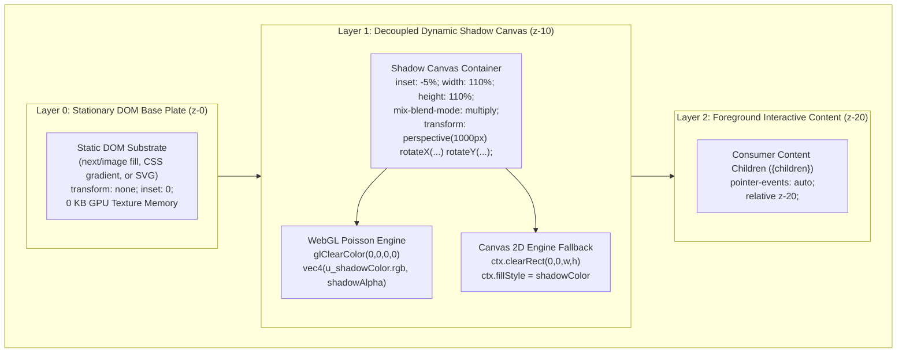

# Shadowcasting Background Component POC

Zero-LCP dynamic shadowcasting for Next.js 16 / React 19 web applications with decoupled static Base Plates, 4-tier progressive degradation, spring-damped interaction physics, and procedural organic shadow synthesis.

---

## 🌟 Value Proposition & Core Pillars

Modern web experiences increasingly rely on organic lighting cues—such as dappled sunlight filtering through swaying trees (*komorebi*), architectural window silhouettes, and botanical branch shadows—to impart tactile depth and materiality to hero sections, headers, and editorial features.

However, conventional browser approaches incur severe penalties: CSS/SVG blur filters cause massive VRAM consumption (49–190 MB) and compositor invalidation stalls; HTML5 Canvas 2D blurs lock up the main thread (18–140 ms CPU box blurs); and canvas elements violate W3C Largest Contentful Paint (§5.1) specifications.

The **Shadowcasting Background Component** solves these challenges through five foundational pillars:

1. **Zero-LCP Floor**: Server-Side Rendered (SSR) static poster rendered via `next/image` with `priority` and `fetchpriority="high"`, locking the LCP paint event to < 1.2s while guaranteeing a Cumulative Layout Shift (CLS) of strictly **0.000**.
2. **Decoupled Static Base Plate (0 KB VRAM Overhead)**: As defined in [ADR-0002](docs/adr/0002-decoupled-transparent-shadow-layer.md), the stationary substrate (**Base Plate**) is rendered directly in the DOM without GPU texture binding, completely eliminating 8–33 MB of duplicate GPU texture allocations. Dynamic shadow synthesis executes on an isolated transparent canvas buffer composited via CSS `mix-blend-mode: multiply`.
3. **4-Tier Progressive Degradation**: Automatically gates rendering fidelity to the optimal **Degradation Tier** based on hardware concurrency, device memory, connection speed, and accessibility preferences:
   - *Full Dynamic*: Hardware-accelerated WebGL 12-tap Poisson-disk **Shadow Synthesis Engine** with distance-scaled **Contact Hardening** and dynamic **Penumbra** expansion (< 0.8ms GPU frame time).
   - *Low Dynamic*: HTML5 Canvas 2D **Shadow Synthesis Engine** fallback with linear alpha blur for environments lacking WebGL2.
   - *Static Poster Fallback*: Permanent zero-runtime display (0% CPU/GPU) on low-memory devices (< 4GB RAM) or when `prefers-reduced-motion` is active.
   - *SSR Floor*: Instant initial paint from a pre-rendered static poster image asset.
4. **Spring-Damped Interaction Physics with Sleeping Loop**: Headless second-order semi-implicit Euler spring integrator ($F = -k \Delta x - c v$) driving fluid cursor tracking, **Interactive Motion**, and 3D perspective tilt, alongside subtle harmonic **Ambient Motion**. Supports optional **Base Plate Motion** coupling when whole-scene tilt is desired. When interaction settles, the `requestAnimationFrame` loop suspends automatically, dropping idle CPU utilization to strictly **0.0%**.
5. **Procedural Organic Shadow Synthesis**: Fragment-shader evaluated Simplex fractional Brownian motion (fBm) noise generating living Komorebi canopy **Shadow Caster** silhouettes with **0 KB heap and texture allocations**, complemented by parametric swaying branch skeleton generators.

---

## 🚀 Quickstart

A drop-in, copy-pasteable Next.js App Router hero example demonstrating clean decoupled layering, sensible default props, and foreground content isolation:

```tsx
import React from "react";
import { ShadowBackground } from "@/components/ShadowBackground";

export default function EditorialHero() {
  return (
    <ShadowBackground
      basePlate="/images/wood-background.webp"
      poster="/images/wood-background.webp"
      caster={{
        type: "image",
        src: "/images/grass.svg",
      }}
      contactHardening={true}
      penumbra={24}
      shadowOpacity={0.65}
      motion="smooth"
      className="relative h-[640px] w-full"
    >
      <div className="relative z-10 flex h-full flex-col justify-center px-8 sm:px-16 max-w-2xl text-white">
        <span className="text-xs uppercase tracking-widest text-amber-300 font-semibold">
          Architectural Series
        </span>
        <h1 className="mt-2 font-serif text-5xl font-bold tracking-tight sm:text-6xl text-white">
          Tactile Depth & Organic Light
        </h1>
        <p className="mt-4 text-lg text-white/80 leading-relaxed">
          Zero-LCP dynamic shadowcasting over a decoupled static Base Plate with
          sub-millisecond GPU execution and spring-damped interactive physics.
        </p>
        <div className="mt-8 flex gap-4">
          <a
            href="/showcase"
            className="rounded-lg bg-white/10 px-6 py-3 font-medium text-white backdrop-blur-md border border-white/20 transition hover:bg-white/20"
          >
            Explore Showcase
          </a>
        </div>
      </div>
    </ShadowBackground>
  );
}
```

---

## 💻 System Prerequisites

| Requirement | Supported Version / Specification |
| :--- | :--- |
| **Node.js** | `18.x` or higher (verified on Node `20.x` LTS) |
| **Package Manager** | `pnpm` `10.x` or `11.x` (`pnpm@11.21.0` specified) |
| **Framework** | [Next.js](https://nextjs.org/) `16.3.5` (App Router with Turbopack) |
| **UI Library** | [React](https://react.dev/) `19.2.8` & React DOM `19.2.8` |
| **Styling** | [Tailwind CSS](https://tailwindcss.com/) `v4` (`@tailwindcss/postcss`) |
| **Language** | [TypeScript](https://www.typescriptlang.org/) `5.x` (`strict: true`) |
| **Graphics Context** | WebGL 1.0 or WebGL 2.0 with automatic Canvas 2D fallback |

---

## 📐 Decoupled Architecture Overview (ADR-0001 & ADR-0002)

As documented in [ADR-0001](docs/adr/0001-shadowcasting-component-architecture.md) and amended in [ADR-0002](docs/adr/0002-decoupled-transparent-shadow-layer.md), the system decouples the static substrate (**Base Plate**) from the dynamic lighting simulation (**Shadow Synthesis Engine**):

### Key Architectural Concepts
1. **Zero Base Plate VRAM Allocation**: In monolithic implementations, binding the Base Plate image inside WebGL duplicated the texture already stored by the browser compositor, consuming 8–33 MB of redundant VRAM. In our decoupled architecture, the Base Plate is rendered exclusively in the DOM using Next.js `<Image fill priority />`. The WebGL engine clears the canvas to pure transparent black (`glClearColor(0, 0, 0, 0)`) and renders exclusively the shadow geometry, consuming **0 KB of Base Plate GPU memory**.
2. **Physical Optical Grounding**: In real-world architecture, a wooden floor or plaster wall remains static within its inertial frame. Only the projected light rays and shadow boundaries shift. By default (`basePlateMotion: false`), the DOM Base Plate has `transform: none`. Interactive 3D perspective distortion (`perspective(1000px) rotateX(...) rotateY(...)`) is applied strictly to the dynamic shadow canvas container.
3. **5% Bleed Overscan Seam Elimination**: Rotating a 2D plane in 3D perspective foreshortens the receding edges. An unexpanded canvas bounded to `inset-0` creates visible rectangular clipping borders along the viewport edge. By configuring the canvas container with `inset: -5%` and dimensions `width: 110%; height: 110%` within an `overflow: hidden` parent, perspective tilt up to $\pm 15^\circ$ is mathematically guaranteed never to breach the visible viewport boundary (providing a 3.73× safety margin).
4. **Seamless Poster Handover**: An SSR pre-rendered composite poster guarantees immediate first paint. Upon deferred client hydration via `requestIdleCallback`, the DOM Base Plate transitions smoothly from the pre-baked poster to the clean Base Plate over 300ms, while the dynamic shadow canvas fades in with `mix-blend-mode: multiply`—eliminating double-shadow artifacts.

### Layered Architecture Diagram



---

## 📁 Asset Directory Structure

Production-ready assets are cataloged in [`public/images/`](public/images/):

| Asset Path | Type | Role | Technical Description |
| :--- | :--- | :--- | :--- |
| [`public/images/wood-background.webp`](public/images/wood-background.webp) | WebP Image | Base Plate | High-resolution architectural dark wood plank substrate with rich grain materiality. |
| [`public/images/decayedpaint-background.webp`](public/images/decayedpaint-background.webp) | WebP Image | Base Plate | High-resolution distressed urban concrete and weathered peeling paint substrate. |
| [`public/images/grass.svg`](public/images/grass.svg) | SVG Vector | Shadow Caster | High-resolution isolated botanical foliage and leaf silhouette alpha mask. |
| [`public/images/shadow-2.webp`](public/images/shadow-2.webp) | WebP Image | Shadow Caster | High-resolution organic tree branch and leaf cluster silhouette alpha mask. |
| [`public/images/base-minimal-studio.svg`](public/images/base-minimal-studio.svg) | SVG Vector | Base Plate | Clean neutral studio surface with soft geometric gradient lighting. |
| [`public/images/base-architectural.svg`](public/images/base-architectural.svg) | SVG Vector | Base Plate | Architectural interior elevation with clean perspective floor and wall planes. |
| [`public/images/base-dappled-forest.svg`](public/images/base-dappled-forest.svg) | SVG Vector | Base Plate | Ambient forest floor vector substrate. |
| [`public/images/caster-branch.svg`](public/images/caster-branch.svg) | SVG Vector | Shadow Caster | Scalable parametric branch and leaf silhouette vector. |

---

## 🗺️ Routes & Application Navigation

The proof-of-concept application is organized into two primary experiences:

### 1. Interactive Playground ([`/`](/))
The primary root page serves as an interactive developer lab and diagnostic staging environment:
- **Real-Time Diagnostic HUD**: Live Core Web Vitals telemetry (LCP, CLS, INP), active rendering engine indicator, FPS counter, and GPU frame render time.
- **Engine Comparison**: Live toggle between WebGL Poisson-disk filtering and Canvas 2D fallback.
- **Caster Switcher**: Swap between raster silhouette masks (`grass.svg`, `shadow-2.webp`), procedural Komorebi noise, and parametric branch skeletons.
- **Motion Physics Calibration**: Real-time tuning of spring presets (`smooth`, `snappy`, `inertial`, `bouncy`), displacement, damping, and ambient sway.
- **Base Plate Motion Toggle**: Interactive switch demonstrating decoupled stationary substrate (`basePlateMotion: false`) vs. coupled whole-scene 3D tilt (`basePlateMotion: true`).

### 2. Showcase Suite ([`/showcase`](/showcase))
A curated gallery hub providing 4 isolated, zero-control design studies demonstrating real-world editorial applications:
- **Architectural Wood Header** ([`/showcase/wood-header`](/showcase/wood-header)): Architectural wood grain paired with soft organic foliage shadows and editorial serif typography.
- **Decayed Paint Feature** ([`/showcase/decayed-paint`](/showcase/decayed-paint)): Weathered concrete plaster substrate paired with botanical leaf shadows and brutalist grotesque sans typography.
- **Scroll Parallax Hero** ([`/showcase/scroll-top`](/showcase/scroll-top)): Top-of-page full-bleed hero banner tracking viewport exit progress (0.0 to 1.0) with dynamic shadow displacement and virtual light angle shifts.
- **Mid-Article Shadow Break** ([`/showcase/scroll-mid`](/showcase/scroll-mid)): Long-form article reading interlude tracking mid-viewport entrance and exit traversal.

---

## 🛠️ Developer Lifecycle Commands

| Command | Purpose | Details |
| :--- | :--- | :--- |
| `pnpm dev` | Start Development Server | Launches Next.js Turbopack development server at `http://localhost:3000`. |
| `pnpm build` | Production Build | Compiles TypeScript, analyzes page dependencies, and outputs optimized static bundles. |
| `pnpm test` | Run Automated Tests | Executes Vitest test runner across all unit, component, and page test suites. |
| `pnpm lint` | Run ESLint Checks | Enforces Next.js ESLint rules and TypeScript strict code quality standards. |

---

## 📊 Testing & Telemetry

### Automated Testing Conventions
All tests run on [Vitest](https://vitest.dev/) configured with the [Happy-DOM](https://github.com/capricorn86/happy-dom) browser environment for sub-second test execution. The test suite covers:
- **Unit Tests**: Headless spring physics math (`src/lib/motion/spring.test.ts`), coordinate projections (`src/lib/motion/coordinates.test.ts`), motion controller state machine (`src/lib/motion/motion-controller.test.ts`), and procedural algorithms (`src/lib/procedural/komorebi.test.ts`, `src/lib/procedural/branch-skeleton.test.ts`).
- **Component Tests**: Multi-tier degradation gating, canvas error boundaries, 3D perspective transforms, and decoupled Base Plate stability in `<ShadowBackground />` (`src/components/ShadowBackground.test.tsx`, `src/components/DiagnosticHUD.test.tsx`, `src/components/engines/engines.test.tsx`).
- **Page & Integration Tests**: Showcase study layouts, typography hierarchy, and DOM structure across all showcase routes (`src/app/showcase/**/*.test.tsx`, `src/app/page.test.tsx`, `src/app/layout.test.tsx`).
- **Documentation Integrity**: Documentation test harness (`src/docs.test.ts`) asserting link validity, route resolution, and API contract parity.

### Core Web Vitals Telemetry
The POC continuously measures production Web Vitals via the official `web-vitals` library and renders real-time diagnostics:
- **Largest Contentful Paint (LCP)**: Preserved at < 1.2s through SSR `<Image priority fill />` static poster preloading.
- **Cumulative Layout Shift (CLS)**: Strictly **0.000** through rigid geometric containment (`relative overflow-hidden` with `absolute inset-0`).
- **Interaction to Next Paint (INP)**: Maintained under 16ms by executing Poisson convolution on the GPU and suspending rAF loops during idle periods.

---

## 📚 Comprehensive Documentation Index

Explore the in-depth architectural and implementation guides:

### Companion Guides
- [TypeScript API Reference](docs/guides/api-reference.md): Authoritative contract of all props, discriminated caster configs, motion presets, and hook signatures.
- [01: Editorial Photographic Hero](docs/guides/01-editorial-hero.md): Design patterns for pairing photographic Base Plates with organic casters and editorial typography.
- [02: Scroll-Driven Parallax](docs/guides/02-scroll-parallax.md): Deep dive into viewport exit progress and mid-article intersection tracking.
- [03: Procedural Komorebi & Foliage Shadows](docs/guides/03-procedural-shadows.md): Math and shader mechanics for 0 KB heap Simplex fBm canopy and parametric branch skeletons.
- [04: Performance Tiering & Zero-LCP Handover](docs/guides/04-performance-and-degradation.md): 4-tier degradation ladder, WebKit core-clamping heuristics, and cooperative hydration.
- [05: Custom Motion Physics & Virtual Lighting](docs/guides/05-custom-physics-and-lighting.md): Calibrating semi-implicit Euler springs, 3D perspective vectors, and Base Plate motion modes.

### Architectural Decisions & Domain Model
- [Domain Context & Ubiquitous Language](CONTEXT.md): Canonical glossary and terminology rules (Base Plate, Shadow Caster, Penumbra, Zero-LCP Floor).
- [ADR Index](docs/adr/README.md): Architectural Decision Record log.
- [ADR-0001: Shadowcasting Component Architecture](docs/adr/0001-shadowcasting-component-architecture.md): Foundation architecture for WebGL Poisson shadow synthesis and SSR posters.
- [ADR-0002: Decoupled Transparent Shadow Layer](docs/adr/0002-decoupled-transparent-shadow-layer.md): Decoupled stationary Base Plate, 0 KB Base Plate VRAM, and 5% bleed overscan.
