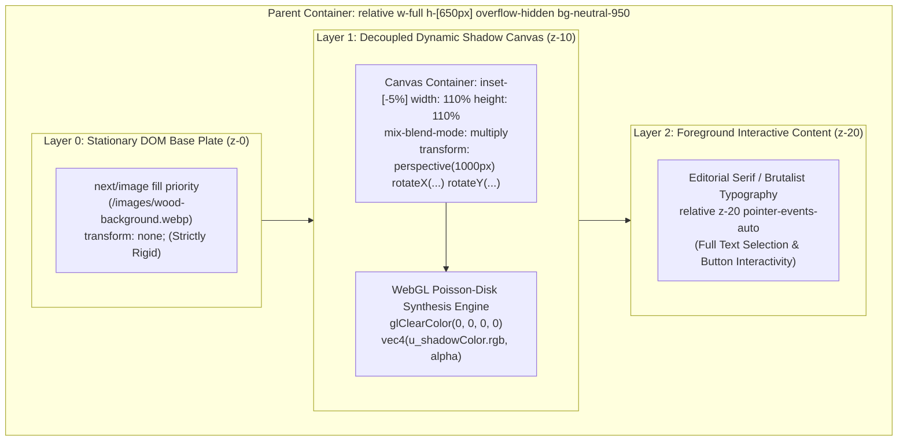

# Scenario Guide: Editorial Photographic Hero

* **Document**: `docs/guides/01-editorial-hero.md`
* **Audience**: Frontend Engineers, Creative Technologists, Art Directors
* **Relevant ADRs**: [ADR-0001 (Dynamic Shadowcasting Component Architecture)](../adr/0001-shadowcasting-component-architecture.md), [ADR-0002 (Decoupled Transparent Shadow Layer Architecture)](../adr/0002-decoupled-transparent-shadow-layer.md)
* **Domain Glossary**: [CONTEXT.md](../../CONTEXT.md)
* **Production Showcases**: [/showcase/wood-header](/showcase/wood-header), [/showcase/decayed-paint](/showcase/decayed-paint), [/showcase](/showcase)

---

## 1. Overview & Architectural Rationale

Modern luxury, architectural, and editorial websites rely heavily on tactile materiality—such as raw timber grain, weathered concrete, textured linen, and distressed plaster—to evoke depth and physical presence. Traditional digital design often isolates these rich photographic substrates from typography using flat dropshadows or dark overlay scrams. This destroys the illusion of light entering a real three-dimensional space.

The **`<ShadowBackground />`** component bridges this gap by casting dynamic, physically grounded shadows directly across photographic substrates. Instead of treating lighting as a decorative afterthought, the component simulates real-world optical phenomena: variable **Penumbra** diffusion, **Contact Hardening**, spring-damped pointer parallax, and ambient wind sway.



### The Decoupled Static Base Plate (ADR-0002)

Earlier iterations of the shadowcasting engine (ADR-0001) utilized a monolithic WebGL canvas that sampled both the **Base Plate** image and the **Shadow Caster** alpha mask inside a single fragment shader. When interactive 3D perspective distortion was applied to the canvas, the entire substrate tilted and warped in 3D space during cursor interaction. In physical reality, a hardwood floor or timber wall does not tilt when overhead branches sway—the substrate remains inert while only the light and shadow boundary shifts.

To solve this, [ADR-0002](../adr/0002-decoupled-transparent-shadow-layer.md) established the **Decoupled Transparent Shadow Layer** architecture:

1. **Physical Optical Grounding**: The photographic **Base Plate** is rendered exclusively in the DOM via standard `next/image` tooling with `transform: none`. It remains completely rigid, stable, and untransformed.
2. **0 KB Base Plate VRAM Overhead**: Under monolithic rendering, uploading a 1080p Base Plate image to a WebGL texture unit consumed **8.3 MB** of GPU VRAM (and over **33.1 MB** at 4K resolution) in redundant duplication of the DOM compositor's memory. With ADR-0002, the shadow synthesis engines render exclusively into a clear transparent buffer (`glClearColor(0.0, 0.0, 0.0, 0.0)`), compositing over the Base Plate via CSS `mix-blend-mode: multiply`. This eliminates **100% of Base Plate VRAM overhead**.
3. **Instantaneous Dynamic Activation (< 2ms)**: Dynamic shadow rendering no longer blocks on downloading and decoding large photographic Base Plates before shader compilation. Shaders initialize and render on the first idle tick.
4. **5% Bleed Overscan Margin**: Tilting a 3D perspective quad inward along the Z-axis causes foreshortening at the perimeter. Positioning the dynamic canvas container with `inset: -5%` (width and height 110%) inside a parent container with `overflow: hidden` mathematically guarantees that canvas edges never clip into view during spring rotation (up to ±15°).
5. **Zero-LCP Floor with Automatic Poster Handover**: Serving an SSR-rendered static poster via `next/image priority` guarantees an LCP paint under 1.2s. Upon dynamic hydration, `<ShadowBackground />` executes a seamless 300ms cross-fade from the poster to the clean Base Plate, preventing double-shadow darkening artifacts.

---

## 2. Study 1: Architectural Timber & Serif Display Typography

* **Live Showcase**: [/showcase/wood-header](/showcase/wood-header)
* **Base Plate Asset**: `/images/wood-background.webp` (96 KB WebP, architectural teak grain)
* **Shadow Caster Asset**: `/images/grass.svg` (Scalable SVG, organic botanical grass silhouette)

```
+-----------------------------------------------------------------------------------+
|  [STUDY 01 // ARCHITECTURAL MATERIALITY]                                          |
|                                                                                   |
|                   ORGANIC LIGHT & TIMBER                                          |
|                                                                                   |
|     A physical study exploring natural branch shadows drifting across an          |
|     organic timber substrate. Decoupled alpha shadows render with variable        |
|     penumbra depth over an unmoving, photorealistic Base Plate.                   |
|                                                                                   |
|  [BASE: WOOD-BACKGROUND.WEBP] • [CASTER: GRASS.SVG] • [PENUMBRA: 28PX]            |
+-----------------------------------------------------------------------------------+
```

### Visual Concept & Art Direction

This study targets architectural portfolios, high-end editorial magazines, and organic brand identities. The warm tones and directional striations of the teak wood substrate pair with a soft, multi-layered botanical shadow caster to simulate late-afternoon sunlight filtering through exterior trees onto an interior panel.

* **Typography**: Stylized white serif display header (`font-serif`, `text-6xl sm:text-7xl md:text-8xl lg:text-9xl`) with tight letterspacing (`tracking-tight`), normal font weight (`font-normal`), and tight leading (`leading-[0.95]`).
* **Subtitles & Metadata**: Neutral, low-contrast supporting copy (`text-neutral-200`, `tracking-wide`, `text-pretty`) paired with an architectural taxonomy badge (`text-[11px] font-mono tracking-[0.25em]` with a pulsing amber status indicator).
* **Specifications Matrix**: Monospace pills with subtle translucent dark backing (`bg-black/40 border border-white/10 backdrop-blur-sm`) displaying physical attributes.

### Layering Isolation (ADR-0001 Pillar 5)

A frequent pitfall in canvas-based hero banners is event interception: canvas elements capture mouse and touch events, preventing users from selecting text, highlighting quotes, or clicking call-to-action buttons.

`<ShadowBackground />` enforces strict three-tier stacking context isolation:

1. **Stationary Base Plate (DOM)**: Positioned at `absolute inset-0 z-0 pointer-events-none`.
2. **Dynamic Shadow Canvas (WebGL / Canvas 2D)**: Positioned at `absolute inset-[-5%] z-10 pointer-events-none mix-blend-mode-multiply`.
3. **Consumer Children (`{children}`)**: Nested directly inside `<ShadowBackground>`, rendered in the foreground at `relative z-20 pointer-events-auto`.

Because both background layers are marked `pointer-events-none`, user pointer interactions pass cleanly through to the foreground typography and interactive elements without lag or event interception.

### Full Code Recipe: Architectural Timber Hero

```tsx
import React from "react";
import type { Metadata } from "next";
import { ShadowBackground } from "@/components/ShadowBackground";

export const metadata: Metadata = {
  title: "Organic Light & Timber — Architectural Wood Header Showcase",
  description:
    "An architectural editorial study pairing a natural timber Base Plate with realistic soft shadowcasting and refined serif typography.",
};

export default function WoodHeaderHero() {
  return (
    <section className="relative w-full h-[650px] min-h-[600px] flex items-center justify-center overflow-hidden bg-neutral-950">
      {/* Decoupled Shadowcasting Background Layer */}
      <ShadowBackground
        basePlate="/images/wood-background.webp"
        poster="/images/wood-background.webp"
        caster={{ type: "image", src: "/images/grass.svg" }}
        className="absolute inset-0"
        tier="auto"
        motion={{ preset: "smooth", ambient: true, maxDisplacementPx: 40 }}
        shadowColor="#050505"
        shadowOpacity={0.82}
        penumbra={28}
        contactHardening={true}
      >
        {/* Layer 2: Foreground Interactive Editorial Overlay (relative z-10 / z-20) */}
        <div className="relative z-10 max-w-5xl mx-auto px-6 py-24 sm:py-32 flex flex-col items-center text-center pointer-events-auto select-auto h-full justify-center">
          {/* Architectural Taxonomy Badge */}
          <div className="inline-flex items-center gap-2.5 px-4 py-1.5 rounded-full border border-white/20 bg-black/40 backdrop-blur-md mb-8 sm:mb-10 shadow-2xl">
            <span className="w-1.5 h-1.5 rounded-full bg-amber-400 animate-pulse" />
            <span className="text-[11px] sm:text-xs font-mono uppercase tracking-[0.25em] text-neutral-200 font-medium">
              STUDY 01 // ARCHITECTURAL MATERIALITY
            </span>
          </div>

          {/* Ultra-Large White Serif Display Header */}
          <h1
            data-testid="wood-header-title"
            className="text-5xl sm:text-7xl md:text-8xl lg:text-9xl font-serif tracking-tight text-white font-normal leading-[0.95] drop-shadow-2xl text-balance max-w-4xl"
          >
            ORGANIC LIGHT &amp; TIMBER
          </h1>

          {/* Refined Architectural Subtitle */}
          <p
            data-testid="wood-header-subtitle"
            className="mt-6 sm:mt-8 text-base sm:text-lg md:text-xl text-neutral-200 font-light max-w-2xl leading-relaxed tracking-wide drop-shadow-md text-pretty"
          >
            A physical study exploring natural branch shadows drifting across an
            organic timber substrate. Decoupled alpha shadows render with variable
            penumbra depth over an unmoving, photorealistic Base Plate.
          </p>

          {/* Architectural Specifications Matrix */}
          <div className="mt-10 sm:mt-12 flex flex-wrap items-center justify-center gap-3 text-[11px] sm:text-xs font-mono text-neutral-300">
            <span className="px-3 py-1 rounded-md bg-black/40 border border-white/10 backdrop-blur-sm">
              BASE: WOOD-BACKGROUND.WEBP
            </span>
            <span className="text-neutral-500">•</span>
            <span className="px-3 py-1 rounded-md bg-black/40 border border-white/10 backdrop-blur-sm">
              CASTER: GRASS.SVG
            </span>
            <span className="text-neutral-500">•</span>
            <span className="px-3 py-1 rounded-md bg-black/40 border border-white/10 backdrop-blur-sm">
              PENUMBRA: 28PX
            </span>
            <span className="text-neutral-500">•</span>
            <span className="px-3 py-1 rounded-md bg-black/40 border border-white/10 backdrop-blur-sm">
              OPACITY: 0.82
            </span>
          </div>
        </div>
      </ShadowBackground>
    </section>
  );
}
```

---

## 3. Study 2: Industrial Distressed Paint & Brutalist Typography

* **Live Showcase**: [/showcase/decayed-paint](/showcase/decayed-paint)
* **Base Plate Asset**: `/images/decayedpaint-background.webp` (694 KB WebP, weathered industrial paint patina)
* **Shadow Caster Asset**: `/images/shadow-2.webp` (104 KB WebP, dense high-frequency foliage silhouette)

```
+-----------------------------------------------------------------------------------+
| ■ STUDY NO. 02 // INDUSTRIAL PATINA           [BASE: DISTRESSED] [PRESET: SNAPPY] |
|                                                                                   |
|                                                                                   |
|                   PATINA & OCCLUSION                                              |
|                                                                                   |
|     INDUSTRIAL DISTRESSED SUBSTRATE STUDY EXPLORING DYNAMIC NATURAL SHADOW        |
|     OCCLUSION, HARMONIC SECOND-ORDER SPRING DYNAMICS, AND ZERO-VRAM PERSISTENCE.  |
|                                                                                   |
|                                                                                   |
| [OCCLUSION: 0.85 ALPHA]   [PENUMBRA: 28PX]   [DISPLACEMENT: ±45PX]  [CONTROLS: 0] |
+-----------------------------------------------------------------------------------+
```

### Visual Concept & Art Direction

This study targets industrial design studios, electronic music releases, and contemporary art institutions. The tactile, chipping patina of decayed industrial paint provides an aggressive, textured canvas for dynamic lighting.

* **Motion Preset**: `"snappy"` spring physics ($k=280, c=30$) with a calibrated 28px **Penumbra**. Unlike the languid drift of the timber study, snappy physics provides immediate, tactile cursor response with minimal settling time.
* **Typography**: Ultra-heavy grotesque sans-serif (`font-black uppercase tracking-tighter text-white leading-none text-6xl md:text-8xl`) dominating the horizontal space.
* **Brutalist Grid Layout**: Monospace coordinate headers, stark divider rules (`border-white/20`), technical data pills (`border border-white/20 bg-neutral-900/60 backdrop-blur-sm`), and a 4-column telemetry footer.

### Full Code Recipe: Brutalist Patina Hero

```tsx
"use client";

import React from "react";
import { ShadowBackground } from "@/components/ShadowBackground";

export default function DecayedPaintHero() {
  return (
    <section className="relative w-full h-[650px] min-h-[600px] flex items-center justify-center overflow-hidden bg-neutral-950">
      {/* Background Decoupled Shadow Engine with Snappy Dynamics */}
      <ShadowBackground
        basePlate="/images/decayedpaint-background.webp"
        poster="/images/decayedpaint-background.webp"
        caster={{ type: "image", src: "/images/shadow-2.webp" }}
        className="absolute inset-0"
        tier="auto"
        motion={{ preset: "snappy", ambient: true, maxDisplacementPx: 45 }}
        shadowColor="#080808"
        shadowOpacity={0.85}
        penumbra={28}
        contactHardening={true}
      >
        {/* Layer 2: Bold Brutalist Display Typography & Industrial Metadata Overlay */}
        <div className="relative z-10 w-full max-w-7xl mx-auto px-6 sm:px-10 lg:px-16 py-20 flex flex-col justify-between pointer-events-auto select-auto h-full">
          {/* Top Industrial Header & Coordinates */}
          <div className="flex flex-col sm:flex-row items-start sm:items-center justify-between gap-4 border-b border-white/20 pb-6 mb-8">
            <div className="flex items-center gap-3">
              <span className="inline-block w-3 h-3 bg-white" />
              <span className="font-mono text-xs uppercase tracking-widest text-zinc-300 font-bold">
                STUDY NO. 02 // INDUSTRIAL PATINA
              </span>
            </div>
            <div className="flex flex-wrap items-center gap-2 font-mono text-xs text-zinc-400">
              <span className="px-2.5 py-1 border border-white/20 bg-neutral-900/60 backdrop-blur-sm text-white font-medium">
                BASE: DISTRESSED LEAD
              </span>
              <span className="px-2.5 py-1 border border-white/20 bg-neutral-900/60 backdrop-blur-sm text-white font-medium">
                CASTER: SHADOW-02
              </span>
              <span className="px-2.5 py-1 border border-white/20 bg-neutral-900/60 backdrop-blur-sm text-white font-medium">
                PRESET: SNAPPY (28PX)
              </span>
            </div>
          </div>

          {/* Central Bold Brutalist Typography Header */}
          <div className="my-auto py-6">
            <h1
              data-testid="showcase-header"
              className="font-black uppercase tracking-tighter text-white leading-none text-6xl md:text-8xl drop-shadow-2xl"
            >
              PATINA &amp; OCCLUSION
            </h1>
            <p className="mt-6 max-w-2xl font-mono text-xs sm:text-sm text-zinc-300 uppercase tracking-wider leading-relaxed drop-shadow-md">
              Industrial distressed substrate study exploring dynamic natural shadow occlusion,
              harmonic second-order spring dynamics, and decoupled zero-VRAM static texture persistence.
            </p>
          </div>

          {/* Bottom Technical Badges & Specifications */}
          <div className="grid grid-cols-2 sm:grid-cols-4 gap-4 pt-6 border-t border-white/20 mt-8 font-mono text-xs">
            <div>
              <div className="text-zinc-500 uppercase tracking-wider text-[10px]">OCCLUSION OPACITY</div>
              <div className="text-white font-bold tracking-tight mt-0.5">0.85 ALPHA</div>
            </div>
            <div>
              <div className="text-zinc-500 uppercase tracking-wider text-[10px]">PENUMBRA RADIUS</div>
              <div className="text-white font-bold tracking-tight mt-0.5">28PX GAUSSIAN</div>
            </div>
            <div>
              <div className="text-zinc-500 uppercase tracking-wider text-[10px]">MAX DISPLACEMENT</div>
              <div className="text-white font-bold tracking-tight mt-0.5">±45PX SPRING DAMPED</div>
            </div>
            <div>
              <div className="text-zinc-500 uppercase tracking-wider text-[10px]">DIAGNOSTIC CONTROLS</div>
              <div className="text-white font-bold tracking-tight mt-0.5">STRICTLY 0 (NONE)</div>
            </div>
          </div>
        </div>
      </ShadowBackground>
    </section>
  );
}
```

---

## 4. Zero-Control Presentation: The Case for Production Immersion

In developer playgrounds and technical prototypes (such as the root `/` route), diagnostic control panels (`<DiagnosticHUD />`), real-time FPS meters, spring stiffness sliders, and degradation tier dropdowns are essential for engineering calibration.

However, in **production editorial hero showcases**, developer controls are strictly eliminated:

| Environment | UI Strategy | Focus | Developer Controls |
| :--- | :--- | :--- | :--- |
| **Development Playground (`/`)** | Diagnostic HUD & Telemetry Badges | Parameter tuning, spring calibration, tier debugging | Visible HUD with sliders, tier select, FPS counters |
| **Production Showcase (`/showcase/*`)** | Clean Art-Directed Typographic Layout | Visual storytelling, emotional impact, brand aesthetic | Strictly 0 (Zero HUD, Zero sliders) |

### Why Zero Controls Create Immersion

1. **Suspension of Disbelief**: Real lighting has no control panel. When users view shadows naturally drifting across timber or distressed paint, the visual brain processes the scene as physical light and geometry. Introducing floating range sliders or diagnostic panels shatters this optical illusion, reducing an atmospheric experience to a mechanical "canvas widget."
2. **Organic User Discovery**: Users discover interactive shadow parallax organically when moving their cursor across headlines or scrolling past hero sections. This subtle responsiveness feels magical precisely because it is unprompted.
3. **Purity of Visual Hierarchy**: Editorial typography demands deliberate focal points and uncluttered whitespace. Eliminating debug overlays preserves the intended contrast ratios and typographic layout.

---

## 5. Troubleshooting & Best Practices

### 1. Parent Container Sizing & Layout Containment

Because `<ShadowBackground />` pins its background substrate and shadow canvas via `absolute inset-0`, the immediate parent container **must establish an explicit height and positioning context**:

```tsx
// ❌ INCORRECT: Missing relative positioning and height constraint
// Causes canvas to collapse to 0px height or bleed into entire document
<div>
  <ShadowBackground basePlate="/images/wood-background.webp" ... />
</div>

// ✅ CORRECT: Explicit relative positioning, set height, and overflow clipping
<div className="relative w-full h-[650px] overflow-hidden bg-neutral-950">
  <ShadowBackground basePlate="/images/wood-background.webp" ... />
</div>
```

> **Important**: Always specify `overflow-hidden` on the parent container. The dynamic shadow layer employs a **5% bleed overscan margin** (`inset: -5%`, width/height 110%) to prevent edge clipping during 3D perspective rotation. Without `overflow-hidden`, this bleed margin will produce unwanted scrollbars.

### 2. High-Contrast Text Legibility Over Photographic Substrates

Photographic Base Plates (such as grain-rich wood or distressed paint) introduce high-frequency luminance noise that can impair reading legibility. Use these art-direction strategies to preserve legibility without washing out the substrate:

* **Text Shadow & Drop Shadows**: Apply `drop-shadow-2xl` (or CSS `text-shadow: 0 4px 24px rgba(0,0,0,0.7)`) to white headers.
* **Translucent Backing Cards**: Wrap metadata and smaller body copy in translucent, dark frosted containers:
  ```html
  <div className="bg-black/40 backdrop-blur-md border border-white/20 rounded-md p-4">
  ```
* **Shadow Opacity Calibration**: Keep `shadowOpacity` between `0.70` and `0.85` for photographic bases. Excessive opacity creates opaque black voids that obscure texture; insufficient opacity washes out the cast silhouette.
* **Text Balancing**: Leverage Tailwind's `text-balance` for headlines and `text-pretty` for body text to avoid orphaned words across responsive viewport breakpoints.

### 3. Zero-LCP Poster Preloading & Core Web Vitals

Under the W3C Largest Contentful Paint specification (§5.1), HTML5 `<canvas>` elements are explicitly disqualified from LCP candidacy. If a hero relies solely on a client-hydrated canvas, the browser cannot record an LCP paint until after JavaScript hydration, triggering severe Web Vitals penalties.

To guarantee sub-1.2s LCP paints:

1. Always specify the `poster` prop on `<ShadowBackground />`:
   ```tsx
   <ShadowBackground
     basePlate="/images/wood-background.webp"
     poster="/images/wood-background.webp"
     ...
   />
   ```
2. During SSR, `<ShadowBackground />` emits a high-priority `next/image` tag:
   ```html
   
   ```
3. When client-side hydration completes, the component automatically cross-fades the poster into the clean Base Plate and fades in the dynamic transparent canvas with `mix-blend-mode: multiply`. This eliminates double-shadow darkening artifacts while guaranteeing a **Cumulative Layout Shift (CLS) of strictly 0.000**.

---

## 6. Summary Checklist for Editorial Heroes

- [x] **Substrate Choice**: High-resolution WebP/AVIF asset without baked shadows.
- [x] **Decoupled Architecture**: `basePlate` remains stationary; dynamic shadow canvas renders to a transparent buffer with `mix-blend-mode: multiply`.
- [x] **Layering Isolation**: Children nested in `<ShadowBackground>` with `relative z-10 pointer-events-auto` for complete text selection and interactivity.
- [x] **Parent Dimensions**: Parent container styled with `relative w-full h-[650px] overflow-hidden`.
- [x] **Zero Controls**: Clean, immersive visual presentation free of diagnostic HUDs or sliders.
- [x] **Zero-LCP Floor**: Valid `poster` prop supplied for immediate SSR preloading.
