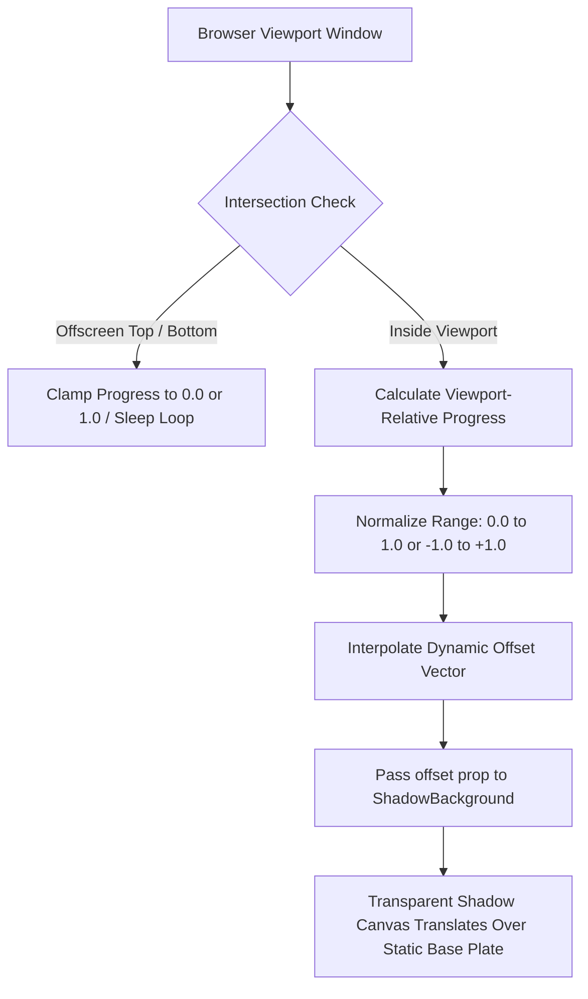

# Scenario Guide: Scroll-Driven Parallax

This scenario guide details the architectural mechanics, mathematical formulas, and production code recipes for implementing viewport-relative scroll parallax using the `<ShadowBackground />` component in Next.js App Router applications.

Following the decoupled architecture established in [ADR-0001](../adr/0001-shadowcasting-component-architecture.md) and [ADR-0002](../adr/0002-decoupled-transparent-shadow-layer.md), the **Base Plate** substrate remains rigid and stationary, while the dynamic **Shadow Caster** and transparent shadow canvas translate across the viewport to produce an authentic sensation of shifting natural illumination.

---

## 1. Introduction: Element-Relative vs. Document-Level Scroll Tracking

In traditional frontend implementations, parallax effects frequently rely on naive document-level scroll listeners:

```typescript
// ❌ Naive Document-Level Tracking (Anti-Pattern)
window.addEventListener("scroll", () => {
  const scrollY = window.scrollY;
  element.style.transform = \`translateY(\${scrollY * 0.3}px)\`;
});
```

While simple, naive document-level scroll tracking suffers from severe architectural flaws:

1. **Unbounded Growth & Inflexibility**: Because `window.scrollY` grows monotonically from `0` to the total document scroll height, multipliers produce arbitrary pixel offsets that break whenever layout dimensions, page content, or display heights vary.
2. **Offscreen CPU/GPU Waste**: Naive listeners continuously recalculate coordinates and trigger style recalculations even when the element is hundreds of pixels above or below the active viewport.
3. **Rigid, Linear Motion**: Directly binding raw scroll coordinates to visual transforms results in stiff, mechanical movement that abruptly halts when the user stops scrolling, destroying the optical illusion of physical mass and natural light.
4. **Substrate Warping**: In older monolithic canvas models, applying scroll transforms to the entire background warped the receiving substrate (the wall or floor), violating physical optical grounding.

### The Element-Relative Paradigm

By contrast, **element-relative scroll tracking** measures an element's spatial geometry relative to the browser viewport:



Key advantages of viewport-relative normalization:
- **Bounded Domain**: Calculations are strictly bounded within normalized intervals ($[0.0, 1.0]$ or $[-1.0, 1.0]$), guaranteeing consistent visual displacement across 13-inch laptops, 4K monitors, and mobile screens.
- **Physical Optical Grounding**: The stationary DOM [Base Plate](../../CONTEXT.md) stays completely still, while the dynamic [Shadow Caster](../../CONTEXT.md) shifts overhead, simulating an astronomical or architectural light vector passing across a real wall.
- **Cooperative Concurrency**: Scroll calculations provide deterministic macro-offsets that combine seamlessly with ambient wind sway and pointer micro-parallax without thread blocking or frame drops.

---

## 2. Pattern 1: Top-of-Page Hero Viewport Exit Parallax

In a top-of-page hero section (such as [`/showcase/scroll-top`](/showcase/scroll-top)), the component occupies the initial viewport fold ($y = 0$). As the visitor reads downstream, the hero progressively scrolls upward out of view. The parallax effect shifts the cast shadow downward, simulating an afternoon light source dipping lower toward the horizon as the observer descends.

```
+------------------------------------+  scrollY = 0
| VIEWPORT                           |  heroProgress = 0.0
| [ Top Hero Banner ]                |  offset.y = 0px
|                                    |
+------------------------------------+  scrollY = heroHeight
| VIEWPORT (Scrolled)                |  heroProgress = 1.0
| [ Editorial Content ]              |  offset.y = +120px
+------------------------------------+
```

### Mathematical Formula

The normalized exit progress $\\mathcal{P}_{\\text{hero}}$ is derived from the window scroll position $S_y$ and the hero container's rendered height $H_{\\text{hero}}$:

$$\\mathcal{P}_{\\text{hero}} = \\min\\left(1.0, \\max\\left(0.0, \\frac{S_y}{H_{\\text{hero}}}\\right)\\right)$$

Where:
- When the page is at the very top ($S_y = 0$), $\\mathcal{P}_{\\text{hero}} = 0.0$.
- When the bottom edge of the hero aligns with the top of the viewport ($S_y = H_{\\text{hero}}$), $\\mathcal{P}_{\\text{hero}} = 1.0$.
- Any subsequent scrolling down the page remains clamped at $1.0$, preventing offscreen displacement runaway.

The dynamic vertical displacement $D_y$ passed to `<ShadowBackground offset={{ x: 0, y: Dy }} />` is:

$$D_y = \\text{round}\\left(\\mathcal{P}_{\\text{hero}} \\times \\Delta_{\\max}\\right)$$

Where $\\Delta_{\\max}$ represents the calibrated maximum travel distance in pixels (e.g., $120\\text{px}$).

### Production Next.js Code Recipe

This recipe is extracted directly from the verified [`/showcase/scroll-top`](/showcase/scroll-top) implementation:

```tsx
"use client";

import React, { useEffect, useRef, useState } from "react";
import Link from "next/link";
import { ShadowBackground } from "@/components/ShadowBackground";
import { ArrowDown, Compass } from "lucide-react";

export default function ScrollTopHeroExample() {
  const heroRef = useRef<HTMLElement>(null);
  const [heroOffset, setHeroOffset] = useState<{ x: number; y: number }>({ x: 0, y: 0 });

  useEffect(() => {
    const handleScroll = () => {
      const scrollY = window.scrollY || 0;
      const heroHeight = heroRef.current?.offsetHeight || 800;
      
      // Calculate normalized progress clamped between 0.0 and 1.0
      const heroProgress = Math.min(1, Math.max(0, scrollY / heroHeight));
      
      // Drive vertical displacement across a 120px travel range
      setHeroOffset({ x: 0, y: Math.round(heroProgress * 120) });
    };

    // Register passive listener to prevent main-thread scroll blocking
    window.addEventListener("scroll", handleScroll, { passive: true });
    window.addEventListener("resize", handleScroll, { passive: true });
    
    // Evaluate initial position on mount
    handleScroll();

    return () => {
      window.removeEventListener("scroll", handleScroll);
      window.removeEventListener("resize", handleScroll);
    };
  }, []);

  return (
    <div className="w-full min-h-screen bg-zinc-950 text-zinc-100 flex flex-col">
      {/* 1. TOP HERO CONTAINER */}
      <section
        ref={heroRef}
        className="relative h-screen min-h-[640px] flex items-center justify-center overflow-hidden"
      >
        <ShadowBackground
          basePlate="/images/wood-background.webp"
          caster={{ type: "image", src: "/images/shadow-2.webp" }}
          className="absolute inset-0"
          tier="auto"
          offset={heroOffset}
          motion={{
            preset: "smooth",
            scrollInfluence: 120,
            ambient: true,
            maxDisplacementPx: 50,
          }}
          shadowColor="#050505"
          shadowOpacity={0.8}
          penumbra={30}
        >
          {/* Contrast Vignette Gradient Overlay */}
          <div
            className="absolute inset-0 bg-gradient-to-t from-zinc-950 via-zinc-950/20 to-zinc-950/60 pointer-events-none"
            aria-hidden="true"
          />

          {/* Foreground Editorial Hero Content */}
          <div className="relative z-10 text-center px-4 max-w-4xl flex flex-col items-center gap-6 pt-16 mx-auto justify-center">
            <div className="inline-flex items-center gap-2 px-3.5 py-1.5 rounded-full text-xs font-mono tracking-widest uppercase bg-zinc-950/60 border border-zinc-700/60 text-zinc-300 backdrop-blur-md">
              <Compass className="w-3.5 h-3.5 text-amber-400" />
              <span>Design Study • Continuous Hero Parallax</span>
            </div>

            <h1 className="text-5xl sm:text-7xl lg:text-8xl font-serif tracking-tight text-white font-light drop-shadow-2xl">
              LIGHT IN TRANSIT
            </h1>

            <p className="max-w-2xl text-base sm:text-lg text-zinc-200 font-light leading-relaxed drop-shadow-md">
              As the viewport descends, subtle virtual light vectors pivot across tactile architectural grain.
            </p>

            <div className="pt-8 flex flex-col items-center gap-3">
              <span className="text-xs font-mono tracking-widest uppercase text-zinc-300">
                SCROLL DOWN TO ANIMATE OCCLUSION
              </span>
              <div className="p-2 rounded-full border border-zinc-700 bg-zinc-900/50 text-amber-400 animate-bounce">
                <ArrowDown className="w-4 h-4" />
              </div>
            </div>
          </div>
        </ShadowBackground>
      </section>

      {/* 2. SUBSEQUENT ARTICLE CONTENT */}
      <article className="w-full max-w-4xl mx-auto px-6 py-24 space-y-8 relative z-20">
        <h2 className="text-3xl font-serif text-white">Editorial Narrative Continuation</h2>
        <p className="text-zinc-300 leading-relaxed font-light">
          Because the Base Plate substrate is fully decoupled from the shadow synthesis canvas,
          scrolling downward does not cause any texture tearing, layer re-rasterization, or
          compositor stalls.
        </p>
      </article>
    </div>
  );
}
```

---

## 3. Pattern 2: Mid-Article Section Viewport Traversal Parallax

When an interactive visual interlude is embedded deep inside a long-form article (as seen in [`/showcase/scroll-mid`](/showcase/scroll-mid)), the component must track three distinct spatial milestones:
1. **Entry**: The top of the container crosses the bottom of the viewport ($y_{\\text{top}} \\le H_{\\text{window}}$).
2. **Midpoint**: The vertical center of the container aligns with the optical center of the screen.
3. **Exit**: The bottom of the container leaves through the top of the viewport ($y_{\\text{bottom}} \\le 0$).

```
             Viewport Top
+------------------------------------+
|                                    |
|       [ Center of Viewport ]       |  <-- progress = 0.5 (offset = 0px)
|                                    |
+------------------------------------+
            Viewport Bottom
      ^
      |  [ Mid-Article Section Enters ]  <-- progress = 0.0 (offset = -40px)
```

### Full-Bleed Section Breakout Styling

In editorial design, body text is usually constrained within a readable column (e.g., `max-w-4xl mx-auto px-6`), but visual interludes demand an immersive, edge-to-edge full-bleed canvas. This is achieved using the viewport breakout pattern:

```css
/* Full-Bleed Viewport Breakout in Tailwind CSS */
className="relative w-screen left-1/2 right-1/2 -ml-[50vw] -mr-[50vw] h-[650px] overflow-hidden"
```

How this works:
- `w-screen`: Forces the container width to match $100\\text{vw}$.
- `left-1/2 right-1/2`: Anchors the container at the horizontal center of the parent column.
- `-ml-[50vw] -mr-[50vw]`: Pulls the margins back by half the viewport width in both directions, stretching the element edge-to-edge without mutating the parent DOM hierarchy.
- `overflow-hidden`: Bounds the internal shadow canvas bleed margins and prevents horizontal scrollbar creation.

### Mathematical Viewport Traversal Formula

Using `getBoundingClientRect()`, we compute the exact vertical geometry:

```typescript
const rect = containerElement.getBoundingClientRect();
const windowHeight = window.innerHeight;
```

1. **Total Traversal Distance** ($D_{\\text{total}}$):
   The total scroll distance over which the container is visible on screen is the viewport height plus the element height:
   $$D_{\\text{total}} = H_{\\text{window}} + H_{\\text{rect}}$$

2. **Current Traversed Distance** ($D_{\\text{current}}$):
   The distance traveled since the top of the element entered the bottom of the viewport:
   $$D_{\\text{current}} = H_{\\text{window}} - y_{\\text{top}}$$

3. **Normalized Progress Ratio** ($\\mathcal{P}_{\\text{mid}}$):
   $$\\mathcal{P}_{\\text{mid}} = \\max\\left(0.0, \\min\\left(1.0, \\frac{D_{\\text{current}}}{D_{\\text{total}}}\\right)\\right)$$
   - $\\mathcal{P}_{\\text{mid}} = 0.0$ at first entrance.
   - $\\mathcal{P}_{\\text{mid}} = 0.5$ when perfectly centered in the reader's view.
   - $\\mathcal{P}_{\\text{mid}} = 1.0$ at the moment the bottom boundary departs.

4. **Centered Symmetric Parallax Offset** ($O_y$):
   To balance the motion so that the shadow is centered ($0\\text{px}$) when the reader is focused directly on the section, we map $[0.0, 1.0]$ to $[-1.0, +1.0]$:
   $$O_y = \\left(\\mathcal{P}_{\\text{mid}} - 0.5\\right) \\times 2 \\times \\Delta_{\\max}$$
   For a $\\Delta_{\\max} = 40\\text{px}$ calibration:
   - On entrance: $O_y = -40\\text{px}$
   - At center screen: $O_y = 0\\text{px}$
   - On exit: $O_y = +40\\text{px}$

### Counter-Parallax Depth Layering

To amplify the sensation of physical depth, child elements (such as pull-quotes or captions) can receive an inverted counter-parallax translation:

```tsx
<div
  className="absolute inset-0 z-10 flex items-center justify-center pointer-events-none"
  style={{ transform: \`translate3d(0, \${midParallaxOffset * -0.3}px, 0)\` }}
>
  <blockquote>“SURFACE DEGRADATION AS A LIGHT-HARVESTING MEDIUM”</blockquote>
</div>
```

When the user scrolls down:
- The background shadow shifts **downward** ($+40\\text{px}$).
- The foreground quote shifts **upward** ($-12\\text{px}$).
- The stationary Base Plate substrate remains completely **static** ($0\\text{px}$).

This multi-plane stereoscopic parallax creates profound optical depth without 3D canvas distortion.

### Production Next.js Code Recipe

Extracted directly from [`/showcase/scroll-mid`](/showcase/scroll-mid):

```tsx
"use client";

import React, { useEffect, useRef, useState } from "react";
import { ShadowBackground } from "@/components/ShadowBackground";
import { Compass, BookOpen } from "lucide-react";

export default function ScrollMidBreakExample() {
  const breakRef = useRef<HTMLElement>(null);
  const [scrollProgress, setScrollProgress] = useState(0);
  const [midParallaxOffset, setMidParallaxOffset] = useState(0);

  useEffect(() => {
    const handleScroll = () => {
      const el = breakRef.current;
      if (!el) return;
      const rect = el.getBoundingClientRect();
      const windowHeight = window.innerHeight;

      // Check if container intersects the active viewport window
      if (rect.top <= windowHeight && rect.bottom >= 0) {
        const totalDistance = windowHeight + rect.height;
        const currentDistance = windowHeight - rect.top;
        const progress = Math.max(0, Math.min(1, currentDistance / totalDistance));
        setScrollProgress(progress);

        // Interpolate vertical parallax offset from -40px to +40px
        const maxOffsetPx = 40;
        const offset = (progress - 0.5) * 2 * maxOffsetPx;
        setMidParallaxOffset(offset);
      } else if (rect.top > windowHeight) {
        setScrollProgress(0);
        setMidParallaxOffset(-40);
      } else {
        setScrollProgress(1);
        setMidParallaxOffset(40);
      }
    };

    window.addEventListener("scroll", handleScroll, { passive: true });
    window.addEventListener("resize", handleScroll, { passive: true });
    handleScroll();

    return () => {
      window.removeEventListener("scroll", handleScroll);
      window.removeEventListener("resize", handleScroll);
    };
  }, []);

  return (
    <article className="w-full max-w-4xl mx-auto px-6 py-20 text-zinc-100">
      <header className="space-y-4 mb-12">
        <div className="inline-flex items-center gap-2 px-3 py-1 rounded-full text-xs font-mono uppercase bg-zinc-900 border border-zinc-700 text-zinc-300">
          <BookOpen className="w-3.5 h-3.5 text-amber-400" />
          <span>Long-Form Editorial Feature</span>
        </div>
        <h1 className="text-5xl font-serif font-light text-white">THE ANATOMY OF TEXTURE</h1>
        <p className="text-zinc-400 font-light leading-relaxed">
          In physical architecture, materiality is defined by how surfaces interact with passing time and shifting light.
        </p>
      </header>

      {/* FULL-BLEED MID-PAGE BREAKOUT SECTION */}
      <section
        ref={breakRef}
        data-scroll-progress={scrollProgress.toFixed(3)}
        className="relative w-screen left-1/2 right-1/2 -ml-[50vw] -mr-[50vw] h-[650px] my-16 overflow-hidden border-y border-neutral-800 shadow-2xl"
      >
        <ShadowBackground
          basePlate="/images/decayedpaint-background.webp"
          caster={{ type: "image", src: "/images/grass.svg" }}
          className="absolute inset-0"
          tier="auto"
          offset={{ x: 0, y: Math.round(midParallaxOffset) }}
          motion={{
            preset: "smooth",
            scrollInfluence: 100,
            ambient: true,
            maxDisplacementPx: 45,
          }}
          shadowColor="#050505"
          shadowOpacity={0.85}
          penumbra={26}
        >
          {/* Subtle Vignette Mask */}
          <div
            className="absolute inset-0 bg-gradient-to-t from-black/75 via-black/20 to-black/60 pointer-events-none"
            aria-hidden="true"
          />

          {/* Foreground Pull-Quote with Counter-Parallax Translation */}
          <div
            className="absolute inset-0 z-10 flex flex-col items-center justify-center text-center p-6 pointer-events-none transition-transform duration-75 ease-out"
            style={{ transform: \`translate3d(0, \${midParallaxOffset * -0.3}px, 0)\` }}
          >
            <div className="max-w-2xl px-8 py-8 rounded-2xl bg-zinc-950/70 backdrop-blur-md border border-neutral-700/60 shadow-2xl flex flex-col items-center gap-4">
              <div className="inline-flex items-center gap-2 px-3 py-1 rounded-full text-[11px] font-mono tracking-widest uppercase bg-zinc-900 border border-neutral-700 text-amber-300">
                <Compass className="w-3 h-3 text-amber-400" />
                <span>Observation // Viewport Interlude</span>
              </div>
              <blockquote className="text-2xl sm:text-3xl font-serif font-light text-white leading-snug">
                “SURFACE DEGRADATION AS A LIGHT-HARVESTING MEDIUM”
              </blockquote>
            </div>
          </div>
        </ShadowBackground>
      </section>

      <section className="space-y-6 text-zinc-300 font-light leading-relaxed">
        <h2 className="text-3xl font-serif text-white">Continuous Narrative Reading</h2>
        <p>
          As reading resumes downstream, the interlude seamlessly exits the viewport, and the shadow synthesis
          loop settles into dormancy.
        </p>
      </section>
    </article>
  );
}
```

---

## 4. Combined Interaction: Preserving Pointer Tracking & Ambient Sway

A critical capability of `<ShadowBackground />` is the harmonious superposition of multiple interactive layers:
1. **Macro-Scroll Displacement**: Driven deterministically by the external `offset` prop ($O_{\\text{scroll}}$).
2. **Micro-Pointer Parallax**: Governed by second-order spring dynamics reacting to cursor movement ($M_{\\text{pointer}}$).
3. **Continuous Ambient Motion**: Sinusoidal foliage sway simulating subtle wind drafts ($A_{\\text{wind}}$).

```
+-------------------------------------------------------------+
| Headless Motion Controller (useMotionController)             |
|   + Mouse Pointer Vectors                                   |
|   + Ambient Harmonic Oscillator (Wind Drift)                |
|   --> Dynamic Spring Solver (Stiffness: 120, Damping: 14)   |
|   --> Generates: motionOutput.shadowOffsetX / Y             |
+-------------------------------------------------------------+
                             +
+-------------------------------------------------------------+
| External Viewport Scroll Controller                         |
|   + Window Scroll / Viewport Traversal Math                 |
|   --> Generates: props.offset.x / y                         |
+-------------------------------------------------------------+
                             ||
                             \/
+-------------------------------------------------------------+
| Unified Shadow Offset Vector (ShadowBackground.tsx)         |
|   offsetX = motionOutput.shadowOffsetX + props.offset.x     |
|   offsetY = motionOutput.shadowOffsetY + props.offset.y     |
+-------------------------------------------------------------+
```

### Mathematical Superposition in the Engine

Inside `src/components/ShadowBackground.tsx`, the coordinate calculation computes the superposition of these layers:

```typescript
const extraOffsetX = offset?.x ?? 0;
const extraOffsetY = offset?.y ?? 0;

const offsetX = (isDynamicMotion ? motionOutput.shadowOffsetX : lightDirection[0]) + extraOffsetX;
const offsetY = (isDynamicMotion ? motionOutput.shadowOffsetY : lightDirection[1]) + extraOffsetY;
```

This separation ensures:
- **No Scroll Hijacking**: Scrolling never interferes with or freezes mouse hover responsiveness.
- **Continuous Micro-Life**: Even while actively scrolling through an article, leaves and branch silhouettes gently sway in the ambient wind.
- **Physical Spring Damping**: High-speed trackpad flings do not create abrupt coordinate teleportation; the spring solver cushions the motion with calibrated inertia.

---

## 5. Performance, Smoothness & Progressive Enhancement

To maintain a strict 60–120 FPS render target and zero Cumulative Layout Shift (CLS), follow these production performance principles:

### 1. Passive Event Listeners

Always register scroll and resize handlers with `{ passive: true }`:

```typescript
window.addEventListener("scroll", handleScroll, { passive: true });
window.addEventListener("resize", handleScroll, { passive: true });
```

Passive listeners signal to the browser engine that `preventDefault()` will never be called, allowing the compositor thread to scroll immediately without waiting for main-thread JavaScript execution.

### 2. RequestAnimationFrame (rAF) Throttling

For high-frequency scroll devices (such as 1000Hz gaming mice or high-precision trackpads), throttle layout measurement calls using `requestAnimationFrame`:

```typescript
useEffect(() => {
  let rafId: number | null = null;

  const updateScroll = () => {
    const el = containerRef.current;
    if (!el) return;
    
    const rect = el.getBoundingClientRect();
    const windowHeight = window.innerHeight;
    
    // Evaluate geometry...
    rafId = null;
  };

  const onScroll = () => {
    if (rafId === null) {
      rafId = requestAnimationFrame(updateScroll);
    }
  };

  window.addEventListener("scroll", onScroll, { passive: true });
  return () => {
    window.removeEventListener("scroll", onScroll);
    if (rafId !== null) cancelAnimationFrame(rafId);
  };
}, []);
```

### 3. Respecting Accessibility & Reduced Motion

Users with vestibular disorders or motion sensitivities configure their operating systems with `prefers-reduced-motion: reduce`. The component suite respects this automatically through the [Degradation Tier](../../CONTEXT.md) system:

1. When `prefers-reduced-motion` is detected, `<ShadowBackground />` automatically gates to the **Static Poster Fallback** or disables dynamic offset translation.
2. In custom scroll hooks, developers should conditionally bypass offset calculations:

```typescript
const prefersReducedMotion = window.matchMedia("(prefers-reduced-motion: reduce)").matches;

if (prefersReducedMotion) {
  // Lock offset to static center position
  setOffset({ x: 0, y: 0 });
  return;
}
```

---

## 6. Architecture & Domain Glossary Reference

When working with scroll parallax, maintain strict adherence to project domain terminology:

| Domain Term | Definition | Forbidden Non-Canonical Terms |
| :--- | :--- | :--- |
| **Base Plate** | The stationary DOM substrate (photographic image, CSS gradient, or color) onto which shadows are cast. | *Background image*, *canvas floor*, *backdrop* |
| **Shadow Caster** | The silhouette, alpha mask, or procedural geometry blocking virtual light. | *Mask image*, *silhouette layer*, *occluder* |
| **Penumbra** | The diffused soft edge of the cast shadow. | *Blur radius*, *feathering* |
| **Contact Hardening** | The physical optical effect where shadows are sharp near contact and diffuse with distance. | *Gradient blur*, *distance blur* |
| **Static Poster Fallback** | The static SSR pre-baked image displayed prior to hydration or on low-tier hardware. | *Placeholder*, *thumbnail*, *backup image* |
| **Degradation Tier** | Hardware performance classification gating dynamic fidelity. | *Device level*, *capability mode* |
| **Ambient Motion** | Continuous sinusoidal swaying independent of user events. | *Idle loop*, *wind animation* |
| **Interactive Motion** | Dynamic adjustments driven by pointer, touch, or scroll events. | *Event animation*, *reactive shadow* |

For complete domain definitions, see [CONTEXT.md](../../CONTEXT.md). For foundational architecture details, see [ADR-0001](../adr/0001-shadowcasting-component-architecture.md) and [ADR-0002](../adr/0002-decoupled-transparent-shadow-layer.md).
