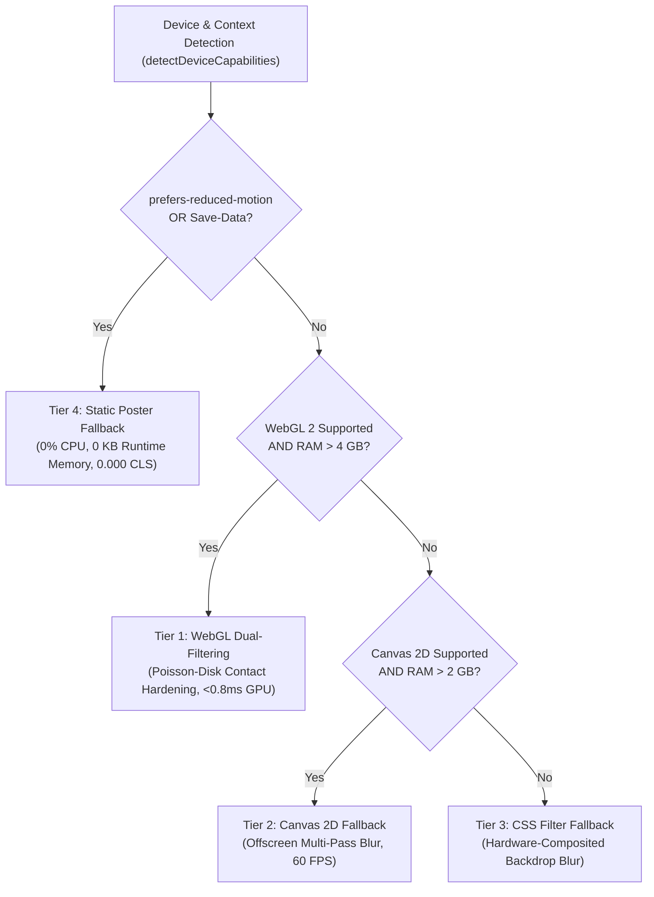

# Scenario Guide: Performance Tiering & Zero-LCP Handover

* **Document**: `docs/guides/04-performance-and-degradation.md`
* **Audience**: Performance Engineers, Frontend Architects, Core Web Vitals Specialists
* **Relevant ADRs**: [ADR-0001 (Dynamic Shadowcasting Component Architecture)](../adr/0001-shadowcasting-component-architecture.md), [ADR-0002 (Decoupled Transparent Shadow Layer Architecture)](../adr/0002-decoupled-transparent-shadow-layer.md)
* **Domain Glossary**: [CONTEXT.md](../../CONTEXT.md)
* **Companion Guides**: [Editorial Hero Guide](01-editorial-hero.md), [Scroll Parallax Guide](02-scroll-parallax.md), [Procedural Shadows Guide](03-procedural-shadows.md), [Custom Physics & Lighting Guide](05-custom-physics-and-lighting.md), [API Reference](api-reference.md)
* **Core Implementation**: `src/lib/device-capabilities.ts`, `src/lib/web-vitals.ts`, `src/components/ShadowBackground.tsx`

---

## 1. The Core Web Vitals Challenge in Dynamic Graphics

Interactive web graphics—such as fluid shadowcasting, canvas particle simulations, and WebGL environments—often come at a steep cost to real-world performance metrics. In modern web development, user experience is rigorously quantified by Google Core Web Vitals:

1. **Largest Contentful Paint (LCP)**: Measures perceptual loading speed. Must render within **≤ 2.5 seconds**.
2. **Interaction to Next Paint (INP)**: Measures main-thread responsiveness to user taps, clicks, and keys. Must settle within **≤ 200 milliseconds**.
3. **Cumulative Layout Shift (CLS)**: Measures visual layout stability. Must maintain a score of **≤ 0.1** (strictly **0.000** for high-fidelity components).

### The Critical Canvas Pitfall in the W3C LCP Specification

Under the official **W3C Largest Contentful Paint specification (§5.1)**, HTML5 `<canvas>` elements are **explicitly excluded from LCP candidacy**. 

If an application replaces an SSR hero section with a client-rendered canvas:
* The browser ignores the canvas during LCP candidate evaluation.
* The LCP measurement falls back to a minor typography element or is delayed indefinitely until deferred client-side scripts complete.
* If the canvas mounts without pre-allocated dimensions or alters the DOM hierarchy after hydration, it introduces jarring layout shifts (**CLS > 0.25**), immediately failing the Google PageSpeed inspection.

### Main-Thread Congestion & Hydration Stalls

Initializing high-end graphics libraries during page bootstrap frequently triggers main-thread CPU bottlenecks:
* Slicing and blurring multi-pass canvas bitmaps on the CPU monopolizes execution for **18ms to 140ms**, starving user input handlers and degrading INP.
* Compiling WebGL shaders synchronously during hydration delays page interactability.
* Downloading redundant 4–16 MB textures for the background substrate strains memory bandwidth on constrained mobile devices.

To overcome these constraints, the **`<ShadowBackground />`** component introduces the **Zero-LCP Handover Lifecycle** and a **4-Tier Degradation Ladder**, delivering photorealistic interactive shadows without sacrificing Core Web Vitals.

---

## 2. The 4-Tier Progressive Degradation Ladder

The rendering pipeline implements a 4-tier degradation strategy that balances visual fidelity with hardware capabilities, battery reserves, network bandwidth, and user accessibility preferences.



### Detailed Degradation Tier Matrix

| Degradation Tier | Engine Subsystem | GPU Frame Time | Main-Thread CPU | Contact Hardening | CLS Score | Ideal Target Environments |
| :--- | :--- | :--- | :--- | :--- | :--- | :--- |
| **Tier 1: Full-Dynamic** | WebGL 2 Poisson-Disk Shader | **< 0.8ms** | **< 0.05ms** | **Yes** (12-tap Poisson) | **0.000** | Modern Desktop (macOS, Windows), iPad Pro, High-End Mobile (Snapdragon 8 Gen 2+, Apple A15+) |
| **Tier 2: Low-Dynamic** | Canvas 2D Offscreen Blur | 1.5ms – 3.2ms | 0.8ms – 2.1ms | Approximated | **0.000** | Mid-Tier Mobile (4 GB RAM, Helio/Exynos), Battery Saver mode, Clamped WebKit environments |
| **Tier 3: CSS Fallback** | Hardware Composited CSS | Variable (Compositor) | < 0.2ms | No (Uniform blur) | **0.000** | Legacy browsers lacking WebGL/Canvas2D acceleration, embedded web views |
| **Tier 4: Static Poster** | Pre-rendered SSR Poster | **0ms** | **0ms** | Pre-baked | **0.000** | `prefers-reduced-motion`, `Save-Data`, Low Memory (≤ 2 GB RAM), SSR initial paint |

---

### Tier 1: WebGL Dual-Filtering with Poisson-Disk Contact Hardening

At the peak of the ladder, dynamic shadows are synthesized via a dedicated fragment shader (`WebGlShadowEngine.tsx`).
* **12-Tap Golden-Spiral Poisson Sampling**: Distributes sampling offsets evenly across the penumbra radius without radial banding or grid artifacts:
  $$\theta_i = i \times 2.39996323 \text{ rad (Golden Angle)}$$
  $$r_i = \frac{\sqrt{i + 0.5}}{\sqrt{12.0}}$$
* **Contact Hardening**: Simulates variable **Penumbra** physics by scaling the blur radius as a function of distance from the physical anchor point:
  $$\text{dist} = \text{clamp}(|\mathbf{uv}_{\text{caster}} - (0.1, 0.1)| \times 1.5, 0.15, 1.8)$$
  $$\text{penumbraFactor} = \text{mix}(1.0, \text{dist}, u_{\text{contactHardening}})$$
* **Performance Budget**: Executes in **< 0.8ms** per frame on modern GPUs, sustaining steady 60–120 FPS during cursor parallax and scroll displacement.

### Tier 2: Canvas 2D Multi-Pass Fallback

When WebGL is unavailable or when the host device reports moderate memory constraints (≤ 4 GB RAM):
* Uses `Canvas2dShadowEngine.tsx` with offscreen canvas pre-rendering.
* Utilizes cached `ImageBitmap` representations of the **Shadow Caster** to prevent garbage collection churn.
* Throttles ambient motion updates to maintain 60 FPS without monopolizing the main thread.

### Tier 3: CSS Filter Fallback

When hardware-accelerated canvas contexts fail or are disabled by administrative browser policies:
* Uses `CssShadowEngine.tsx` with CSS `filter: blur(...)` and 3D hardware-accelerated transforms (`transform: translate3d(...)`).
* Isolates rendering onto a dedicated compositor layer (`transform-gpu`) to avoid reflow.

### Tier 4: Static Poster Fallback (Zero-LCP Floor)

The essential architectural floor of the component:
* Renders a pre-baked photographic composite combining the **Base Plate** and the cast shadow directly in SSR HTML.
* Consumes strictly **0% CPU** and **0 KB VRAM**.
* Guarantees absolute accessibility compliance and acts as the unyielding foundation for the Zero-LCP handover.

---

## 3. The Zero-LCP Handover Lifecycle

The primary design principle of `<ShadowBackground />` is that **interactive fidelity must never delay initial page paint**. The component enforces a cooperative four-phase lifecycle:

```mermaid
sequenceDiagram
    autonumber
    actor User
    participant Browser as Browser Client
    participant SSR as Next.js Server (SSR)
    participant DOM as DOM Compositor
    participant Engine as Dynamic Shadow Engine

    User->>Browser: Navigate to Route (HTTP GET)
    Browser->>SSR: Request HTML Document
    SSR-->>Browser: Return HTML with <Image priority fill> (Base Plate + Static Poster)
    Note over Browser,DOM: Phase 1 & 2: Instant SSR Paint
    Browser->>DOM: Parse HTML & Download High-Priority Poster WebP
    DOM->>User: Paint Static Poster Fallback (FCP < 0.8s, LCP < 1.2s Recorded & Locked)
    
    Note over Browser,Engine: Phase 3: Cooperative Hydration
    Browser->>Browser: Execute Critical Application JavaScript (INP Safe)
    Browser->>Engine: requestIdleCallback({ timeout: 1000 })
    
    Note over DOM,Engine: Phase 4: Dynamic Handover
    Engine->>Engine: Compile Shaders & Init Transparent Canvas (0 KB Base Plate VRAM)
    Engine->>DOM: Mount Transparent Shadow Canvas (inset-[-5%], mix-blend-mode: multiply)
    DOM->>DOM: 300ms CSS Cross-Fade (Poster opacity 100 -> 0; Dynamic Canvas active)
    DOM->>User: Interactive 60-120 FPS Motion Active (CLS = 0.000)
```

### Phase-by-Phase Breakdown

#### Phase 1: Server-Side Rendering (SSR)
During server rendering, `<ShadowBackground />` evaluates `basePlate` and `poster` props. It generates standard Next.js `<Image />` elements configured with `priority`, `fill`, and `sizes="100vw"`:
```tsx
<Image
  src={poster || basePlate}
  alt=""
  fill
  priority
  sizes="100vw"
  className="object-cover transition-opacity duration-300"
  aria-hidden="true"
/>
```
The browser receives complete markup with `<link rel="preload">` headers automatically injected by Next.js.

#### Phase 2: First Paint & LCP Registration (FCP < 0.8s, LCP < 1.2s)
The browser downloads the lightweight static poster WebP image over high-priority HTTP streams. When the image renders, the browser records the **Largest Contentful Paint**. Because standard `` elements qualify as LCP candidates under W3C §5.1, the LCP metric is successfully captured and permanently locked before any dynamic JavaScript executes.

#### Phase 3: Cooperative Client Hydration via `requestIdleCallback`
Instead of executing shader compilation and WebGL context creation synchronously during React hydration (which would block the main thread and degrade INP), dynamic activation is scheduled cooperatively:

```typescript
// Cooperative idle hydration in ShadowBackground.tsx
let idleId: number | null = null;
let timerId: ReturnType<typeof setTimeout> | null = null;

const mountDynamic = () => {
  if (!cancelled) {
    const hasWebGl = isWebGLSupported();
    setWebGlSupported(hasWebGl);
    setIsDynamicMounted(true);
    const resolved =
      targetTier === "low-dynamic" || !hasWebGl ? "low-dynamic" : "full-dynamic";
    onTierChange?.(resolved);
  }
};

if (typeof window !== "undefined" && typeof window.requestIdleCallback === "function") {
  idleId = window.requestIdleCallback(mountDynamic, { timeout: 1000 });
} else {
  timerId = setTimeout(mountDynamic, 100);
}
```

The browser only mounts the dynamic canvas when main-thread execution time is completely idle, ensuring critical UI clicks and route interactions execute with sub-20ms responsiveness.

#### Phase 4: The 300ms Cross-Fade Handover (Preventing Double Shadows)
When a distinct `poster` is provided (where the poster contains a pre-baked static shadow), mounting a transparent dynamic shadow canvas directly on top would double the shadow density, resulting in an unsightly flash or pop.

`<ShadowBackground />` resolves this through a seamless two-layer cross-fade:
1. The **Base Plate** (clean, unshadowed substrate) sits permanently at the bottom.
2. The **Static Poster** (pre-baked shadow) sits directly above it with `opacity-100`.
3. When dynamic hydration completes, the Static Poster receives `opacity-0` with a smooth `transition-opacity duration-300`.
4. Simultaneously, the transparent dynamic canvas activates with `mix-blend-mode: multiply`.

The result is a visually imperceptible cross-fade that preserves layout stability (**CLS strictly 0.000**).

---

## 4. Accessibility & Low-End Hardware Gating Heuristics

The detection engine (`src/lib/device-capabilities.ts`) implements comprehensive client capability sniffing to assign the optimal **Degradation Tier**:

```typescript
export function detectDeviceCapabilities(): DeviceCapabilities {
  // SSR fallback returns safe static baseline
  if (typeof window === "undefined") {
    return {
      cores: 4,
      isAppleDevice: false,
      isCoreClamped: false,
      deviceMemoryGb: null,
      prefersReducedMotion: false,
      saveData: false,
      effectiveConnectionType: null,
      hasWebGL2: false,
      webGlRenderer: null,
      recommendedTier: "static-poster",
      reasons: ["SSR Initial Render"],
    };
  }

  const nav = window.navigator as Navigator & {
    deviceMemory?: number;
    connection?: { saveData?: boolean; effectiveType?: string };
  };

  const rawCores = nav.hardwareConcurrency || 2;
  const isApple = /Macintosh|iPhone|iPad|iPod/.test(nav.userAgent);
  // WebKit clamps hardwareConcurrency to 2 to prevent fingerprinting
  const isCoreClamped = isApple && rawCores <= 2;

  const deviceMemory = nav.deviceMemory ?? null;
  const prefersReducedMotion = window.matchMedia("(prefers-reduced-motion: reduce)").matches;
  const saveData = !!nav.connection?.saveData;
  // ... tier classification logic
}
```

### Heuristic Decision Breakdown

#### 1. Reduced Motion Accessibility (`prefers-reduced-motion: reduce`)
* **Standard**: WCAG 2.2 Success Criterion 2.3.3 (Animation from Interactions).
* **Action**: Immediately forces **Tier 4: Static Poster Fallback**.
* **Rationale**: Eliminates vestibular triggers, dizziness, and nausea for users sensitive to parallax motion.

#### 2. Network Data Saver (`navigator.connection.saveData`)
* **Standard**: Client Hints / Network Information API.
* **Action**: Forces **Tier 4: Static Poster Fallback**.
* **Rationale**: Prevents downloading procedural or dynamic assets when users are on metered cellular data plans.

#### 3. RAM Thresholds (`navigator.deviceMemory`)
* **RAM ≤ 2 GB**: Degrades to **Tier 4: Static Poster Fallback**. Protects low-end Android Go and budget smartphones from Out-Of-Memory process termination.
* **2 GB < RAM ≤ 4 GB**: Degrades to **Tier 2: Low-Dynamic Canvas 2D**. Eliminates heavy WebGL buffer allocation while preserving motion.
* **RAM > 4 GB**: Promotes to **Tier 1: Full-Dynamic WebGL**.

#### 4. WebKit CPU Core Clamping Awareness
* Apple Safari deliberately clamps `navigator.hardwareConcurrency` to `2` on iOS and macOS to mitigate browser fingerprinting.
* Blindly treating `cores <= 2` as a low-end device would unnecessarily degrade flagship Apple Silicon hardware (M1–M4, A16–A18).
* Our heuristic inspects `isAppleDevice`: if an Apple device reports 2 cores, it is recognized as `isCoreClamped` and permitted into **Tier 1**, whereas a non-Apple device reporting ≤ 2 cores is safely assigned to **Tier 2**.

#### 5. WebGL 2 Context & Hardware Renderer Inspection
* Tests context creation with `{ failIfMajorPerformanceCaveat: true }`. If the browser would rely on software rasterization (such as SwiftShader or LLVMpipe), the engine aborts WebGL to avoid catastrophic CPU load, dropping gracefully to Tier 2 or 3.

---

## 5. Live Telemetry & Verification Harness

Applications can track real-time Core Web Vitals and component performance using the diagnostic hooks:

```tsx
import { ShadowBackground } from "@/components/ShadowBackground";
import { DiagnosticHUD } from "@/components/DiagnosticHUD";

export function ProductionHeroWithHUD() {
  return (
    <div className="relative h-screen w-full">
      <ShadowBackground
        basePlate="/images/wood-background.webp"
        poster="/images/wood-background.webp"
        caster={{ type: "image", src: "/images/shadow-1.webp" }}
        penumbra={24}
        contactHardening={true}
        onTierChange={(tier) => console.log("Degradation tier active:", tier)}
        onRest={() => console.log("Spring settled: animation dormant (0% CPU)")}
        onWake={() => console.log("Spring woken: animation loop active")}
        className="h-full w-full"
      >
        <div className="relative z-10 flex h-full items-center justify-center">
          <h1 className="font-serif text-6xl text-white">Performant Architecture</h1>
        </div>
      </ShadowBackground>

      {/* Floating telemetry HUD tracking LCP, INP, CLS, FPS, and VRAM */}
      <DiagnosticHUD />
    </div>
  );
}
```

### Telemetry Verification Checklist

* [ ] **LCP ≤ 1.2s**: Static poster preloaded via Next.js `priority` attribute.
* [ ] **CLS = 0.000**: Absolutely no layout shifting between SSR paint and dynamic hydration.
* [ ] **INP ≤ 30ms**: Hydration deferred through cooperative `requestIdleCallback`.
* [ ] **Idle CPU = 0%**: Animation loop pauses completely when spring velocity settles below rest threshold.
* [ ] **VRAM Footprint < 4 MB**: 100% elimination of Base Plate GPU textures via [ADR-0002](../adr/0002-decoupled-transparent-shadow-layer.md).
