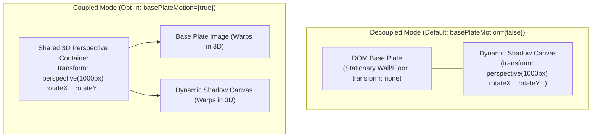

# Scenario Guide: Custom Motion Physics & Virtual Lighting

* **Document**: `docs/guides/05-custom-physics-and-lighting.md`
* **Audience**: Creative Technologists, Interaction Designers, Frontend Engineers
* **Relevant ADRs**: [ADR-0001 (Dynamic Shadowcasting Component Architecture)](../adr/0001-shadowcasting-component-architecture.md), [ADR-0002 (Decoupled Transparent Shadow Layer Architecture)](../adr/0002-decoupled-transparent-shadow-layer.md)
* **Domain Glossary**: [CONTEXT.md](../../CONTEXT.md)
* **Companion Guides**: [Editorial Hero Guide](01-editorial-hero.md), [Scroll Parallax Guide](02-scroll-parallax.md), [Procedural Shadows Guide](03-procedural-shadows.md), [Performance & Degradation Guide](04-performance-and-degradation.md), [API Reference](api-reference.md)
* **Core Implementation**: `src/lib/motion/spring.ts`, `src/lib/motion/coordinates.ts`, `src/lib/motion/motion-controller.ts`, `src/components/ShadowBackground.tsx`

---

## 1. Physical Foundations of Second-Order Spring Dynamics

In web motion design, animations are frequently constructed using CSS transitions, easing curves (such as `cubic-bezier`), or linear interpolation (`lerp`). While simple, easing curves possess fundamental flaws when responding to continuous, unpredictable user inputs:

1. **Velocity Discontinuity**: When a user rapidly redirects their cursor, an easing animation cancels its previous curve and begins anew from zero velocity, producing jarring, mechanical hitches.
2. **Artificial Timing**: Easing functions require arbitrary duration specifications (e.g. `300ms`), forcing slow gestures and fast flicks into identical artificial timeframes.
3. **Continuous CPU Churn**: Standard `lerp` functions asymptotically approach target values ($x_{t+1} = x_t + (x_{	ext{target}} - x_t) 	imes 0.1$) without ever reaching mathematical zero, causing `requestAnimationFrame` loops to run indefinitely and draining mobile device batteries.

```
       [Cursor / Pointer Target]
                 O
                / \  (Interactive Pointer Parallax)
               /   \
              /     v
    [Virtual Spring Physics Solver]
      F_total = -k*(x - target) - c*v
              |
              v  (Semi-Implicit Euler Integration)
    [Dynamic Shadow Displacement]
      perspective(1000px) rotateX(...) rotateY(...)
```

The **`<ShadowBackground />`** component models all **Interactive Motion** using a second-order Newtonian spring-mass-damper system (`src/lib/motion/spring.ts`). Springs naturally preserve momentum, absorb abrupt reversals, and mathematically settle into complete rest (0% idle CPU).

---

## 2. The Semi-Implicit Euler Integrator

A physical spring-mass-damper system is governed by a second-order linear ordinary differential equation (ODE):

$$m rac{d^2 x}{d t^2} + c rac{d x}{d t} + k (x - x_{	ext{target}}) = 0$$

Where:
* $m$ = **Mass**: Resistance to change in acceleration (inertia).
* $c$ = **Damping Coefficient**: Viscous friction opposing velocity.
* $k$ = **Stiffness**: Elastic restoring force proportional to displacement.

### Formulation & Symplectic Stability

Standard explicit Euler integration updates position before velocity ($x_{t+\Delta t} = x_t + v_t \Delta t$, $v_{t+\Delta t} = v_t + a_t \Delta t$). For oscillatory systems like springs, explicit Euler continually introduces artificial energy, causing the simulation to diverge and explode into infinite values.

Instead, `<ShadowBackground />` executes **Semi-Implicit Euler Integration** (also known as symplectic Euler):

$$	ext{displacement} = x_t - x_{	ext{target}}$$
$$F_{	ext{spring}} = -k \cdot 	ext{displacement}$$
$$F_{	ext{damping}} = -c \cdot v_t$$
$$a = rac{F_{	ext{spring}} + F_{	ext{damping}}}{m}$$
$$v_{t+\Delta t} = v_t + a \cdot \Delta t$$
$$x_{t+\Delta t} = x_t + v_{t+\Delta t} \cdot \Delta t$$

Because the updated velocity $v_{t+\Delta t}$ is immediately used to advance position $x_{t+\Delta t}$, the integrator preserves the phase-space volume of the system, guaranteeing unconditional bounded stability.

```typescript
// Semi-implicit Euler step in src/lib/motion/spring.ts
export function stepSpring1D(
  state: SpringState1D,
  target: number,
  dt: number,
  config: SpringConfig
): SpringState1D {
  // Clamp delta time to maximum of 64ms (approx 4 frames at 60fps) to maintain stability
  const safeDt = Math.min(dt, 0.064);

  // Substep integration for high stiffness stability
  const steps = safeDt > 0.032 ? 2 : 1;
  const subDt = safeDt / steps;

  let pos = state.position;
  let vel = state.velocity;

  const { stiffness, damping, mass } = config;
  const invMass = 1.0 / Math.max(0.01, mass);

  for (let i = 0; i < steps; i++) {
    const displacement = pos - target;
    const springForce = -stiffness * displacement;
    const dampingForce = -damping * vel;
    const totalForce = springForce + dampingForce;

    const acceleration = totalForce * invMass;
    vel += acceleration * subDt;
    pos += vel * subDt;
  }

  return { position: pos, velocity: vel };
}
```

### Numerical Stability Safeguards

1. **Delta Time Clamping**: Large frame pauses (e.g., when the user switches browser tabs) would otherwise introduce large $\Delta t$ spikes (> 500ms). The integrator strictly clamps $\Delta t \le 0.064	ext{s}$ (64ms).
2. **Adaptive Substepping**: When $\Delta t > 0.032	ext{s}$, the integrator subdivides the tick into two discrete half-steps ($	ext{subDt} = \Delta t / 2$), eliminating numerical divergence under high stiffness configurations.
3. **Zero-Drift Rest Detection (`isSpringAtRest2D`)**:
   A spring is declared at rest when both position displacement and instantaneous velocity fall below absolute thresholds:
   $$|x - x_{	ext{target}}| < 0.001 \quad 	ext{and} \quad |v| < 0.001$$
   Once confirmed over multiple consecutive frames, the motion loop goes dormant, triggering the `onRest` callback and stopping `requestAnimationFrame` to ensure **0% idle CPU load**.

---

## 3. Calibrated Motion Presets

The engine ships with four physically calibrated presets in `SPRING_PRESETS`:

```typescript
export const SPRING_PRESETS: Record<"snappy" | "smooth" | "inertial" | "bouncy", SpringConfig> = {
  snappy:   { stiffness: 280, damping: 30, mass: 1.0 },
  smooth:   { stiffness: 160, damping: 20, mass: 1.0 },
  inertial: { stiffness: 70,  damping: 14, mass: 2.2 },
  bouncy:   { stiffness: 180, damping: 11, mass: 1.0 },
};
```

### Comparative Dynamics Matrix

| Preset | Stiffness ($k$) | Damping ($c$) | Mass ($m$) | Damping Ratio ($\zeta$) | Settling Time ($t_s$) | Motion Profile | Best Use Case |
| :--- | :--- | :--- | :--- | :--- | :--- | :--- | :--- |
| **`snappy`** | `280` | `30` | `1.0` | $0.89$ (Near Critical) | $pprox 240	ext{ms}$ | Rapid, immediate lock-on with zero overshoot. Feels razor-sharp and tightly coupled. | Interactive UI cards, precision controls, portfolio showcases |
| **`smooth`** | `160` | `20` | `1.0` | $0.79$ (Slight Underdamping) | $pprox 420	ext{ms}$ | Gentle luxury drift with organic lag behind cursor. Silky deceleration. | **Default**: Editorial headers, hero photography, luxury websites |
| **`inertial`** | `70` | `14` | `2.2` | $0.56$ (Heavy Inertia) | $pprox 850	ext{ms}$ | Heavy cinematic momentum. Extended glide with deliberate weight. | Full-screen hero landing pages, dramatic ambient backgrounds |
| **`bouncy`** | `180` | `11` | `1.0` | $0.41$ (Underdamped Spring) | $pprox 680	ext{ms}$ | Dynamic physical rebound with 2-3 visible oscillation waves before rest. | Playful interactive micro-interactions, brand showcases |

The damping ratio $\zeta$ mathematically determines oscillation behavior:
$$\zeta = rac{c}{2 \sqrt{k \cdot m}}$$
* $\zeta \ge 1.0$: Overdamped (sluggish, no oscillation).
* $\zeta = 1.0$: Critically damped (fastest return to equilibrium without overshoot).
* $0.7 < \zeta < 0.9$: Near critical damping (luxury response, minimal overshoot: `snappy`, `smooth`).
* $\zeta < 0.7$: Underdamped (springy rebound: `inertial`, `bouncy`).

---

## 4. Virtual Light Coordinates & Projection Mathematics

Shadow casting relies on computing virtual light positions relative to the component bounds (`src/lib/motion/coordinates.ts`).

```
              Virtual Light Source L(x, y, z)
                         *
                        / 
                       /  Light Rays
                      v
             [Shadow Caster]  (Anchor origin: 0.1, 0.1)
                    /
                   /
                  v
       +--------------------+  Base Plate
       |       ======       |
       |       Shadow       |  Displaced in OPPOSITE direction:
       |                    |  dir = -normalizedPointer
       +--------------------+
```

### 1. Pointer Coordinate Normalization
Client mouse or touch coordinates are mapped relative to the component rectangle into a center-origin normalized space:

$$u = rac{x_{	ext{client}} - 	ext{rect.left}}{	ext{rect.width}}, \quad v = rac{y_{	ext{client}} - 	ext{rect.top}}{	ext{rect.height}}$$
$$ar{x} = 2u - 1, \quad ar{y} = 2v - 1 \quad (ar{x}, ar{y} \in [-1.0, 1.0])$$

### 2. Inverse Light Displacement Projection
In physical optics, when a light source moves to the upper-right ($ar{x} > 0, ar{y} < 0$), the projected shadow shifts in the **opposite direction** to the lower-left:

$$	ext{shadowDir}_x = -ar{x}, \quad 	ext{shadowDir}_y = -ar{y}$$
$$\Delta x_{	ext{shadow}} = 	ext{shadowDir}_x \cdot 	ext{maxDisplacementPx}$$
$$\Delta y_{	ext{shadow}} = 	ext{shadowDir}_y \cdot 	ext{maxDisplacementPx} + (	ext{scrollProgress} \cdot 	ext{scrollInfluencePx})$$

### 3. 3D Light Direction Vector
The virtual light direction unit vector $\mathbf{L} = (L_x, L_y, L_z)$ is derived using light elevation $Z_{	ext{elev}}$:

$$	ext{length} = \sqrt{ar{x}^2 + ar{y}^2 + Z_{	ext{elev}}^2}$$
$$\mathbf{L} = \left( rac{ar{x}}{	ext{length}}, rac{ar{y}}{	ext{length}}, rac{Z_{	ext{elev}}}{	ext{length}} 
ight)$$

### 4. Poisson Contact Hardening Math
In the WebGL fragment shader (`WebGlShadowEngine.tsx`), the effective penumbra radius expands dynamically based on distance from the physical anchor origin $(0.1, 0.1)$:

$$	ext{dist} = 	ext{clamp}(|\mathbf{uv}_{	ext{caster}} - (0.1, 0.1)| 	imes 1.5, 0.15, 1.8)$$
$$	ext{penumbraFactor} = 	ext{mix}(1.0, 	ext{dist}, u_{	ext{contactHardening}})$$
$$\mathbf{R}_{	ext{tap}} = \left(rac{1}{W}, rac{1}{H}
ight) \cdot (	ext{penumbra} \cdot 	ext{penumbraFactor})$$

Samples close to the stem origin ($0.1, 0.1$) produce tight, sharp shadows, while distant leaf clusters exhibit wide, diffused penumbras.

---

## 5. Decoupled vs. Coupled Base Plate Motion

One of the most consequential architectural decisions in `<ShadowBackground />` is the distinction between stationary substrate rendering and coupled whole-scene motion, established in [ADR-0002](../adr/0002-decoupled-transparent-shadow-layer.md).



### Architectural Comparison

| Attribute | Decoupled Mode (`basePlateMotion={false}`, Default) | Coupled Mode (`basePlateMotion={true}`, Opt-In) |
| :--- | :--- | :--- |
| **Physical Optical Reality** | **Authentic**: Substrate remains stationary; only light and shadow move across it. | **Stylized**: The entire scene tilts in 3D space like a floating interactive card. |
| **Base Plate GPU VRAM** | **0 KB**: Rendered purely in the DOM via standard `next/image`. | **0 KB**: Still rendered in DOM, but transformed via CSS 3D. |
| **Perspective Transform** | Applied strictly to the shadow canvas (`inset-[-5%]`). | Applied to the shared parent wrapper surrounding Base Plate and canvas. |
| **Edge Clipping Risk** | **Zero**: 5% bleed overscan margin prevents quad boundary clipping. | Substrate corners may tilt outside viewport boundaries unless container is padded. |
| **Recommended Contexts** | 95% of web use cases: Editorial hero headers, photography, article backgrounds. | Stylized UI cards, 3D product tilt showcases, arcade-cabinet UI panels. |

### When to Keep Base Plate Stationary (ADR-0002 Default)

In physical architecture, a cedar panel, concrete wall, or timber floor does not tilt when overhead branches sway in the wind. Decoupling the shadow canvas from the Base Plate provides:
* True optical realism where light plays across a stable, tactile plane.
* Crisp, distortion-free display of high-resolution photographic textures.
* Elimination of visual disorientation for users reading foreground typography.

### When to Enable Coupled Scene Motion (`basePlateMotion={true}`)

Coupled motion is appropriate when the entire component is conceptualized as an autonomous, floating physical object—such as an interactive credit card, a 3D glass badge, or a gaming card:

```tsx
<ShadowBackground
  basePlate="/images/wood-background.webp"
  caster={{ type: "image", src: "/images/shadow-1.webp" }}
  basePlateMotion={true}
  motion="snappy"
  className="relative h-[480px] w-[360px] rounded-3xl shadow-2xl"
>
  <div className="relative z-10 flex h-full flex-col justify-end p-8 text-white">
    <h3 className="text-xl font-bold">Interactive Card</h3>
    <p className="text-xs text-neutral-300">Whole-scene 3D perspective coupling</p>
  </div>
</ShadowBackground>
```

---

## 6. Code Recipes & Configuration Examples

### Recipe 1: Custom Fine-Tuned Spring Physics

Configuring custom stiffness, damping, and mass for bespoke brand interactions.

```tsx
import { ShadowBackground } from "@/components/ShadowBackground";

export function CustomPhysicsHero() {
  return (
    <ShadowBackground
      basePlate="/images/wood-background.webp"
      poster="/images/wood-background.webp"
      caster={{ type: "komorebi", scale: 4.2 }}
      motion={{
        stiffness: 140,       // Slightly softer than smooth
        damping: 18,          // Controlled deceleration
        mass: 1.4,            // Subtle cinematic inertia
        maxDisplacementPx: 60,// Expanded reach
        scrollInfluence: 35,  // Vertical light shift per scroll unit
      }}
      className="relative h-[650px] w-full"
    >
      <div className="relative z-10 flex h-full items-center px-12 text-white">
        <h1 className="font-serif text-5xl">Bespoke Brand Kinetics</h1>
      </div>
    </ShadowBackground>
  );
}
```

### Recipe 2: Dynamic Lighting Controls

Binding virtual light elevation and light direction vectors dynamically.

```tsx
import { useState } from "react";
import { ShadowBackground } from "@/components/ShadowBackground";

export function DynamicLightingDemo() {
  const [elevation, setElevation] = useState(1.2);
  const [penumbra, setPenumbra] = useState(24);

  return (
    <div className="relative w-full">
      <ShadowBackground
        basePlate="/images/decayedpaint-background.webp"
        caster={{ type: "branch", depth: 4 }}
        penumbra={penumbra}
        contactHardening={true}
        lightDirection={[30, 40, elevation]}
        motion="smooth"
        className="relative h-[600px] w-full"
      >
        <div className="relative z-10 flex h-full items-center justify-center">
          <div className="rounded-xl bg-black/60 p-6 text-white backdrop-blur-md">
            <h2 className="text-xl font-semibold">Virtual Light Rig</h2>
            <div className="mt-4 space-y-3 text-sm">
              <label className="block">
                Light Elevation: {elevation}x
                <input
                  type="range"
                  min="0.4"
                  max="2.5"
                  step="0.1"
                  value={elevation}
                  onChange={(e) => setElevation(parseFloat(e.target.value))}
                  className="w-full"
                />
              </label>
              <label className="block">
                Penumbra Radius: {penumbra}px
                <input
                  type="range"
                  min="8"
                  max="48"
                  step="2"
                  value={penumbra}
                  onChange={(e) => setPenumbra(parseInt(e.target.value, 10))}
                  className="w-full"
                />
              </label>
            </div>
          </div>
        </div>
      </ShadowBackground>
    </div>
  );
}
```

### Summary of Best Practices

1. **Default to Decoupled**: Retain `basePlateMotion={false}` for editorial backgrounds to maintain physical realism and legibility.
2. **Match Presets to Brand Tone**: Use `smooth` for luxury and architectural experiences, `snappy` for productivity interfaces, and `inertial` for immersive hero intros.
3. **Always Set `contactHardening={true}`**: Anchors shadows optically to their source origin, preventing uniform "muddy" blur across the composition.
4. **Leverage Zero-Idle Architecture**: Let the second-order solver settle naturally to avoid unnecessary mobile battery drain.
