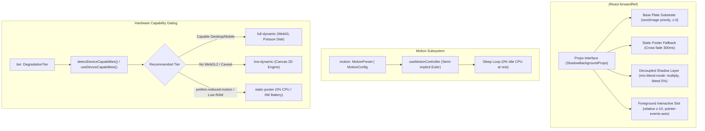

# Comprehensive TypeScript API Reference & Type Contracts

[← Documentation Index](../../README.md) · [Domain Glossary (CONTEXT.md)](../../CONTEXT.md) · [ADR-0001: Architecture](../adr/0001-shadowcasting-component-architecture.md) · [ADR-0002: Decoupled Layer](../adr/0002-decoupled-transparent-shadow-layer.md)

---

## Overview

The **Shadowcasting Background Component System** provides a performant, progressively enhanced Next.js background component (`<ShadowBackground />`) that casts photorealistic dynamic, procedural, and interactive shadows across stationary background imagery.

This document serves as the authoritative, exhaustive TypeScript API reference and type contract specification for the component system, including component props, pluggable shadow caster configurations, spring physics presets, degradation tiers, custom React hooks, and architectural invariants mandated by [ADR-0001](../adr/0001-shadowcasting-component-architecture.md) and [ADR-0002](../adr/0002-decoupled-transparent-shadow-layer.md).



---

## Primary Component: `<ShadowBackground />`

### Import & Signature

```typescript
import { ShadowBackground } from "@/components/ShadowBackground";
import type { ShadowBackgroundProps } from "@/components/ShadowBackground";

export const ShadowBackground = React.forwardRef<HTMLDivElement, ShadowBackgroundProps>(
  function ShadowBackground(props, ref) { /* ... */ }
);
```

### Complete Props Interface (`ShadowBackgroundProps`)

The `<ShadowBackground />` component extends `React.HTMLAttributes<HTMLDivElement>`, allowing standard HTML attributes (`id`, `role`, `style`, `aria-*`, `data-*`) to be forwarded directly to the root DOM container.

| Prop | Type | Default | Required | Description |
| :--- | :--- | :--- | :--- | :--- |
| `basePlate` | `string \| undefined` | `undefined` | **Yes** (Runtime) | URL/path to static Base Plate image or CSS background substrate. Rendered as a stationary, rigid DOM substrate underneath the shadow layer per [ADR-0002](../adr/0002-decoupled-transparent-shadow-layer.md). Default: `undefined`. |
| `poster` | `string \| undefined` | `undefined` | No | Static composite poster image URL loaded with Next.js SSR priority for 0.000 CLS zero-LCP floor. Automatically cross-fades out over 300ms once dynamic shadow synthesis hydrates. Default: `undefined`. |
| `caster` | `ShadowCasterConfig` | *None* | **Yes** | Pluggable **Shadow Caster** configuration. Discriminated union `{ type: "image"; src: string } | { type: "komorebi"; ... } | { type: "branch"; ... }`. Required. |
| `tier` | `DegradationTier` | `"auto"` | No | Progressive enhancement degradation tier override: `"auto" \| "force-static" \| "force-dynamic"` (or canonical tiers `"static-poster" \| "low-dynamic" \| "full-dynamic"`). Default: `"auto"`. |
| `motion` | `MotionConfig \| MotionPreset` | `"smooth"` | No | Spring physics, parallax, and ambient motion configuration: `{ preset?: MotionPreset; scrollInfluence?: number; ambient?: boolean; maxDisplacementPx?: number; spring?: Partial<SpringConfig> }`. Accepts a `MotionPreset` union string or a configuration object. Default: `"smooth"`. |
| `penumbra` | `number` | `24` | No | Shadow blur radius in pixels (8px to 48px). Default: `24`. Controls softness and optical diffusion. |
| `offset` | `{ x: number; y: number }` | `{ x: 0, y: 0 }` | No | External displacement offset vector in pixels for scroll parallax or manual repositioning. Default: `{ x: 0, y: 0 }`. |
| `shadowColor` | `string` | `"#000000"` | No | Hex/RGB shadow tint color. Default: `"#000000"`. |
| `shadowOpacity` | `number` | `0.65` | No | Shadow opacity in range [0..1]. Default: `0.65`. |
| `virtualLight` | `VirtualLightOptions` | `{ elevation: 1.0, angle: 45, distance: 1.0 }` | No | Coordinate options: `{ elevation?: number; angle?: number; distance?: number }`. Projected into dynamic directional light vector and penumbra dilation. |
| `basePlateMotion` | `boolean` | `false` | No | Coupled motion toggle. When false (default), Base Plate is stationary ([ADR-0002](../adr/0002-decoupled-transparent-shadow-layer.md)). When true, Base Plate shifts with parallax. Default: `false`. |
| `contactHardening` | `boolean` | `true` | No | Optical contact hardening toggle. When true, produces distance-proportional sharpness near contact surfaces and progressive softening at distance. Default: `true`. |
| `lightDirection` | `[number, number, number]` | `[20, 25, 1]` | No | Initial static directional light vector `[X, Y, Z]` when interactive motion is dormant. Default: `[20, 25, 1]`. |
| `fit` | `"cover" \| "contain" \| "fill"` | `"cover"` | No | CSS object-fit mode applied to the Base Plate and poster images. Default: `"cover"`. |
| `blendMode` | `"multiply" \| "normal"` | `"multiply"` | No | CSS `mix-blend-mode` applied to the decoupled transparent shadow layer. Default: `"multiply"`. |
| `onTierChange` | `(tier: string) => void` | `undefined` | No | Callback invoked upon tier classification or runtime fallback (e.g. WebGL context loss). Default: `undefined`. |
| `onRest` | `() => void` | `undefined` | No | Callback invoked when the spring physics solver reaches rest state and enters rAF dormancy. Default: `undefined`. |
| `onWake` | `() => void` | `undefined` | No | Callback invoked when user interaction wakes the animation loop. Default: `undefined`. |
| `className` | `string` | `undefined` | No | CSS classes applied to root container. Must define bounding dimensions (e.g. `relative h-[640px] w-full`). Default: `undefined`. |
| `children` | `ReactNode` | `undefined` | No | Interactive foreground elements rendered at relative z-10 with pointer-events-auto ([ADR-0001](../adr/0001-shadowcasting-component-architecture.md) Pillar 5). Default: `undefined`. |

---

## Pluggable Shadow Caster Configuration (`ShadowCasterConfig`)

Shadow casters define the light-blocking silhouette or procedural mathematical generator. Abstracted as a strictly typed TypeScript discriminated union:

```typescript
export type ShadowCasterConfig =
  | { type: "image"; src: string }
  | { type: "komorebi"; windSpeed?: number; canopyDensity?: number; scale?: number }
  | { type: "branch"; depth?: number; branchAngle?: number; leafDensity?: number; seed?: number };
```

### 1. Raster Silhouette Caster (`type: "image"`)

Loads an external alpha-channel PNG, SVG, or WebP silhouette into a GPU texture unit.

```typescript
export interface RasterCasterConfig {
  type: "image";
  /** Path or URL to the alpha mask / silhouette image asset */
  src: string;
  /** Optional opacity multiplier specific to this caster (0.0 to 1.0) */
  opacity?: number;
}
```

*Example:*
```tsx
<ShadowBackground
  basePlate="/images/wood-background.webp"
  caster={{
    type: "image",
    src: "/images/shadow-1.webp",
    opacity: 0.8,
  }}
/>
```

### 2. Procedural Komorebi Sunlight Caster (`type: "komorebi"`)

Synthesizes organic dappled canopy sunlight directly in the fragment shader using 2D Simplex noise and fractional Brownian motion (fBm). Allocates **0 KB** of GPU texture memory.

```typescript
export interface ProceduralKomorebiConfig {
  type: "komorebi";
  /** Density of foliage shadow clusters (default: 1.0) */
  density?: number;
  /** Contrast threshold between bright sunlight pools and dark shadow (default: 1.2) */
  contrast?: number;
  /** Spatial frequency / scale of dappled light spots (default: 3.5) */
  scale?: number;
  /** Wind drift animation speed (default: 0.5) */
  speed?: number;
}
```

*Example:*
```tsx
<ShadowBackground
  basePlate="/images/wood-background.webp"
  caster={{
    type: "komorebi",
    density: 1.1,
    contrast: 1.3,
    scale: 4.0,
    speed: 0.6,
  }}
/>
```

### 3. Parametric Branch Caster (`type: "branch"`)

Generates a dynamic botanical tree branch skeleton using recursive harmonic oscillation and parametric joint trees (< 15 KB heap overhead).

```typescript
export interface ProceduralBranchConfig {
  type: "branch";
  /** Recursive branching depth of the joint skeleton (default: 4) */
  depth?: number;
  /** Leaf density multiplier attached to terminal nodes (default: 5) */
  leafDensity?: number;
  /** Harmonic wind sway speed multiplier (default: 0.7) */
  swaySpeed?: number;
}
```

---

## Motion Configuration & Physics Types

Interactive shadow motion combines second-order spring physics, 3D perspective parallax, scroll elevation tracking, and ambient wind sway.

### `MotionPreset`

Calibrated spring response curves:

```typescript
export type MotionPreset = "snappy" | "smooth" | "inertial" | "bouncy" | "none";
```

| Preset | Stiffness ($k$) | Damping ($c$) | Mass ($m$) | Dynamic Behavior & Feel |
| :--- | :--- | :--- | :--- | :--- |
| `"snappy"` | `280` | `30` | `1.0` | Ultra-responsive, rapid settling. Ideal for crisp micro-interactions and editorial navigation headers. |
| `"smooth"` | `160` | `20` | `1.0` | Critically damped natural motion. Default setting for balanced desktop and touch tracking. |
| `"inertial"` | `70` | `14` | `2.2` | Heavy physical momentum with prolonged glide. Simulates heavy overhead tree branches or massive architectural fixtures. |
| `"bouncy"` | `180` | `11` | `1.0` | Under-damped spring with playful elastic oscillations. Suitable for creative agency portfolios. |
| `"none"` | — | — | — | Completely disables spring physics and interaction listeners. Renders static or ambient-only shadow. |

### `SpringConfig`

Second-order spring physics solver parameters:

```typescript
export interface SpringConfig {
  /** Spring constant stiffness (k), e.g. 160 */
  stiffness: number;
  /** Damping friction coefficient (c), e.g. 20 */
  damping: number;
  /** Virtual inertial mass (m), e.g. 1.0 */
  mass: number;
}

export const SPRING_PRESETS: Record<"snappy" | "smooth" | "inertial" | "bouncy", SpringConfig>;
```

### `MotionConfig`

Comprehensive interactive motion options:

```typescript
export interface MotionConfig {
  /** Named baseline preset to inherit from */
  preset?: MotionPreset;
  /** Explicit spring stiffness override */
  stiffness?: number;
  /** Explicit spring damping override */
  damping?: number;
  /** Explicit spring mass override */
  mass?: number;
  /** Partial spring config override block */
  spring?: Partial<SpringConfig>;
  /** Toggle ambient wind motion while pointer is at rest (default: true) */
  ambient?: boolean;
  /** Alias for ambient */
  ambientMotion?: boolean;
  /** Speed multiplier for ambient sway (default: 0.8) */
  ambientSpeed?: number;
  /** Pixel displacement amplitude for ambient sway (default: 8) */
  ambientStrength?: number;
  /** Maximum pointer parallax displacement in pixels (default: 45) */
  maxDisplacementPx?: number;
  /** Scroll parallax influence in pixels, or boolean toggle (default: 25) */
  scrollInfluence?: boolean | number;
}
```

### `VirtualLightOptions`

Coordinate options defining virtual light position:

```typescript
export interface VirtualLightOptions {
  /** Light elevation factor above surface plane (default: 1.0) */
  elevation?: number;
  /** Incident light angle in degrees (default: 45) */
  angle?: number;
  /** Virtual distance factor from caster to substrate (default: 1.0) */
  distance?: number;
}
```

---

## Degradation Tiers & Progressive Enhancement

Progressive enhancement guarantees that all users receive a pristine visual experience regardless of device memory, CPU constraints, or browser support.

### `DegradationTier`

```typescript
export type DegradationTier =
  | "auto"
  | "static-poster"
  | "low-dynamic"
  | "full-dynamic"
  | "force-static"
  | "force-dynamic";
```

### Progressive Degradation Ladder

| Tier | Engine Subsystem | Capabilities & Techniques | Target Hardware & Conditions |
| :--- | :--- | :--- | :--- |
| `"full-dynamic"` | Hardware WebGL 2 / 1 | 12-tap Poisson-disk shader dual-filtering, dynamic contact hardening, 3D perspective transform, 60–120 FPS. | Desktop, high-end mobile (≥ 4GB RAM, ≥ 4 CPU cores, hardware WebGL). |
| `"low-dynamic"` | Canvas 2D Engine | Software blur filtering with linear penumbra scaling, 2D parallax offset, `ctx.globalCompositeOperation = multiply`. | Mid-tier mobile, devices without WebGL 2, or WebGL context recovery fallback. |
| `"static-poster"` | Static Next.js `<Image />` | 0% CPU, 0% GPU, zero animation loops. Renders pre-baked composite poster with `priority` and `fetchpriority="high"`. | Devices with `prefers-reduced-motion`, `saveData` enabled, low memory (< 4GB RAM), or SSR initial render. |
| `"auto"` | Automatic Evaluation | Dynamically detects device capabilities and routes to the optimal tier above. | Default mode for production deployments. |
| `"force-static"` | Manual Override | Permanently locks the component to the Static Poster Fallback. | Testing, low-power kiosks, battery-saver modes. |
| `"force-dynamic"`| Manual Override | Bypasses hardware memory and core gating, forcing dynamic WebGL mount. | Development testing, benchmark suites. |

---

## Custom Hooks Reference

The shadowcasting system exposes headless hooks for building custom interactive stages, diagnosing hardware, or implementing custom canvas rendering pipelines.

### `useMotionController`

Headless second-order spring physics integrator that unifies pointer parallax, touch gestures, window scroll tracking, and ambient wind sway with power-saving rAF dormancy.

```typescript
export function useMotionController(
  options: UseMotionControllerOptions
): {
  output: MotionOutput;
  handlers: {
    onPointerMove: (e: React.PointerEvent<HTMLElement>) => void;
    onPointerLeave: () => void;
    onTouchStart: (e: React.TouchEvent<HTMLElement>) => void;
    onTouchMove: (e: React.TouchEvent<HTMLElement>) => void;
    onTouchEnd: () => void;
    onTouchCancel: () => void;
  };
};
```

#### Options (`UseMotionControllerOptions`)

```typescript
export interface UseMotionControllerOptions {
  /** React ref attached to the interactive container DOM node */
  containerRef: React.RefObject<HTMLElement | null>;
  /** Spring physics configuration parameters */
  springConfig?: SpringConfig;
  /** Maximum pixel displacement for pointer parallax (default: 45) */
  maxDisplacementPx?: number;
  /** Virtual light elevation multiplier (default: 1.0) */
  lightElevation?: number;
  /** Scroll parallax influence in pixels (default: 25) */
  scrollInfluencePx?: number;
  /** Enable continuous harmonic ambient motion (default: true) */
  ambientMotion?: boolean;
  /** Ambient sway speed multiplier (default: 0.8) */
  ambientSpeed?: number;
  /** Ambient sway amplitude in pixels (default: 8) */
  ambientStrength?: number;
}
```

#### Output (`MotionOutput`)

```typescript
export interface MotionOutput {
  /** Computed horizontal shadow offset in pixels */
  shadowOffsetX: number;
  /** Computed vertical shadow offset in pixels */
  shadowOffsetY: number;
  /** Direct spring position X */
  x?: number;
  /** Direct spring position Y */
  y?: number;
  /** Dynamic penumbra dilation multiplier based on spring velocity */
  penumbraMultiplier: number;
  /** 3D perspective rotation around Y axis in degrees */
  skewX: number;
  /** 3D perspective rotation around X axis in degrees */
  skewY: number;
  /** Boolean flag indicating if spring velocity is below rest epsilon (< 0.05) */
  isAtRest: boolean;
  /** Normalized pointer UV coordinates in range [0..1] */
  normalizedUV: { u: number; v: number };
  /** Raw pointer coordinates relative to container */
  rawPointer: { x: number; y: number };
  /** Window scroll progression normalized [0..1] */
  scrollProgress: number;
  /** Instantaneous scroll velocity delta in pixels */
  scrollDeltaY: number;
  /** Computed 3D unit vector pointing towards the virtual light */
  virtualLightDirection: { x: number; y: number; z: number };
}
```

---

### `useDeviceCapabilities`

React hook providing reactive hardware capability telemetry, accessibility preferences, and degradation tier recommendations.

```typescript
export function useDeviceCapabilities(): DeviceCapabilities;
```

#### Telemetry Interface (`DeviceCapabilities`)

```typescript
export interface DeviceCapabilities {
  /** Logical CPU core count reported by navigator.hardwareConcurrency */
  cores: number;
  /** Boolean indicating Apple platform (macOS, iOS, iPadOS) */
  isAppleDevice: boolean;
  /** Boolean indicating WebKit 2-core anti-fingerprinting clamping */
  isCoreClamped: boolean;
  /** Available device RAM in gigabytes (from navigator.deviceMemory, or null) */
  deviceMemoryGb: number | null;
  /** User prefers reduced motion setting from matchMedia */
  prefersReducedMotion: boolean;
  /** Save-Data mode enabled in navigator.connection */
  saveData: boolean;
  /** Network connection effective type ('4g', '3g', '2g', 'slow-2g', or null) */
  effectiveConnectionType: string | null;
  /** Hardware-accelerated WebGL 2 context availability */
  hasWebGL2: boolean;
  /** Unmasked GPU renderer string from WEBGL_debug_renderer_info */
  webGlRenderer: string | null;
  /** Automatically recommended Degradation Tier */
  recommendedTier: DegradationTier;
  /** Diagnostic reasoning log explaining tier selection */
  reasons: string[];
}
```

#### Evaluation Rules & Heuristics
1. **Accessibility Gate**: If `prefers-reduced-motion` is active, immediately assigns `"static-poster"`.
2. **Data-Saver Gate**: If `navigator.connection.saveData` is `true`, immediately assigns `"static-poster"`.
3. **Memory Gate**: If `deviceMemoryGb <= 2`, assigns `"static-poster"`; if `deviceMemoryGb <= 4`, assigns `"low-dynamic"`.
4. **Core Gate with Clamping Correction**: Devices with `< 4` cores downgrade to `"low-dynamic"`. On Apple devices where WebKit clamps `hardwareConcurrency` to `2`, WebGL context support and memory are verified to avoid false-positive downgrades.
5. **Context Gate**: If WebGL 2 context creation fails, downgrades to `"low-dynamic"` (Canvas 2D fallback).

---

## Architectural Constraints & Invariants

All implementations must conform to the architectural mandates established in [ADR-0001](../adr/0001-shadowcasting-component-architecture.md) and [ADR-0002](../adr/0002-decoupled-transparent-shadow-layer.md):

### ADR-0001: Foundational Pillars
1. **Adaptive Shadow Synthesis Engine**: Primary hardware-accelerated WebGL engine executing 12-tap Poisson-disk sampling with automatic Canvas 2D fallback.
2. **Pluggable Shadow Casters**: Polymorphic support for raster alpha masks, procedural Simplex noise (*komorebi*), and parametric branch skeletons.
3. **Zero-LCP Hydration Floor**: Pre-rendered SSR static poster image loaded with `priority` and `fetchpriority="high"`, achieving strictly **0.000 Cumulative Layout Shift (CLS)** and instant First Contentful Paint.
4. **Power-Saving Dormancy**: Semi-implicit Euler spring solver that automatically sleeps (`0.0% CPU`) when pointer and ambient motion reach rest tolerance.
5. **Stacking & Layout Isolation**: DOM layers isolated at `pointer-events-none z-0`, with interactive consumer children wrapped at `relative z-10` with `pointer-events-auto`.

### ADR-0002: Decoupled Transparent Shadow Layer
1. **Stationary Base Plate**: The **Base Plate** is rendered exclusively in the DOM as a rigid, untransformed substrate. It never tilts or warps in 3D space unless explicitly opted into via `basePlateMotion={true}`.
2. **Zero Base Plate VRAM Overhead**: Base Plate textures are eliminated from WebGL texture memory (strictly **0 KB** GPU allocation for the Base Plate), eliminating duplicate memory consumption and preventing iOS Safari Jetsam terminations.
3. **5% Bleed Overscan (`inset-[-5%]`)**: The dynamic shadow canvas expands 5% beyond container bounds (`w-[110%] h-[110%]`) to prevent rectangular edge clipping during 3D perspective tilt.
4. **Double-Shadow Elimination**: A 300ms CSS opacity cross-fade smoothly transitions from the pre-baked SSR poster to the clean Base Plate upon dynamic canvas hydration, preventing composite shadow stacking.

---

## Domain Glossary & Terminology Rules

To prevent conceptual drift, code and documentation must strictly use canonical domain terms defined in [CONTEXT.md](../../CONTEXT.md):

| Canonical Term | Definition | Forbidden Term (Avoid) |
| :--- | :--- | :--- |
| **Base Plate** | The background layer (image, color, or gradient) onto which cast shadows are composited. Stationary and rigid by default. | *Background image, canvas floor, backdrop* |
| **Base Plate Motion** | Optional configuration mode that couples the Base Plate to interactive pointer and 3D perspective motion. | *Camera tilt, whole-page parallax* |
| **Shadow Caster** | The silhouette, alpha mask, or procedural geometry source that defines the shape blocking light. | *Mask image, silhouette layer, occluder* |
| **Shadow Synthesis Engine** | The rendering subsystem (WebGL, Canvas 2D) responsible for projecting, blurring, and compositing the cast shadow. | *Blur processor, renderer, filter layer* |
| **Penumbra** | The diffused, soft edge of a cast shadow where light is partially occluded. | *Blur radius, feathering* |
| **Contact Hardening** | Optical effect where shadows are sharp near the contact surface and become progressively softer as distance increases. | *Gradient blur, distance blur* |
| **Static Poster Fallback** | A single static composite image rendered during SSR or displayed on low-end devices to eliminate runtime rendering cost. | *Placeholder, thumbnail, backup image* |
| **Degradation Tier** | The client performance classification determining dynamic fidelity (`"full-dynamic"`, `"low-dynamic"`, `"static-poster"`). | *Device level, capability mode* |
| **Ambient Motion** | Continuous background animation of the shadow caster independent of user interaction (e.g. wind sway). | *Idle loop, wind animation* |
| **Interactive Motion** | Dynamic adjustments to shadow perspective, displacement, or penumbra driven by user events (pointer, touch, scroll). | *Event animation, reactive shadow* |

---

## Complete Usage Examples

### Example 1: Editorial Photographic Hero (Decoupled Layer)

```tsx
import { ShadowBackground } from "@/components/ShadowBackground";

export default function EditorialHero() {
  return (
    <ShadowBackground
      basePlate="/images/wood-background.webp"
      poster="/images/wood-background.webp"
      caster={{
        type: "image",
        src: "/images/shadow-1.webp",
      }}
      motion="snappy"
      penumbra={24}
      contactHardening={true}
      shadowOpacity={0.65}
      className="relative h-[680px] w-full"
    >
      <div className="relative z-10 flex h-full flex-col justify-center px-12">
        <h1 className="text-5xl font-bold tracking-tight text-neutral-900">
          Atmospheric Shadowcasting
        </h1>
        <p className="mt-4 max-w-lg text-lg text-neutral-700">
          Photorealistic dynamic shadows cast across a stationary hardwood substrate.
        </p>
      </div>
    </ShadowBackground>
  );
}
```

### Example 2: Procedural Sunlight with Custom Physics Overrides

```tsx
import { ShadowBackground } from "@/components/ShadowBackground";

export default function KomorebiHero() {
  return (
    <ShadowBackground
      basePlate="/images/decayedpaint-background.webp"
      caster={{
        type: "komorebi",
        density: 1.2,
        contrast: 1.4,
        scale: 4.0,
        speed: 0.5,
      }}
      motion={{
        preset: "smooth",
        stiffness: 140,
        damping: 18,
        ambient: true,
        ambientSpeed: 0.7,
        scrollInfluence: 30,
        maxDisplacementPx: 50,
      }}
      penumbra={32}
      shadowColor="#1a140e"
      shadowOpacity={0.70}
      className="relative h-screen w-full"
    >
      <main className="relative z-10 p-16">
        <h2 className="text-4xl font-light text-white">Procedural Komorebi</h2>
      </main>
    </ShadowBackground>
  );
}
```
