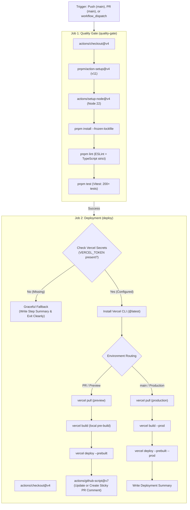
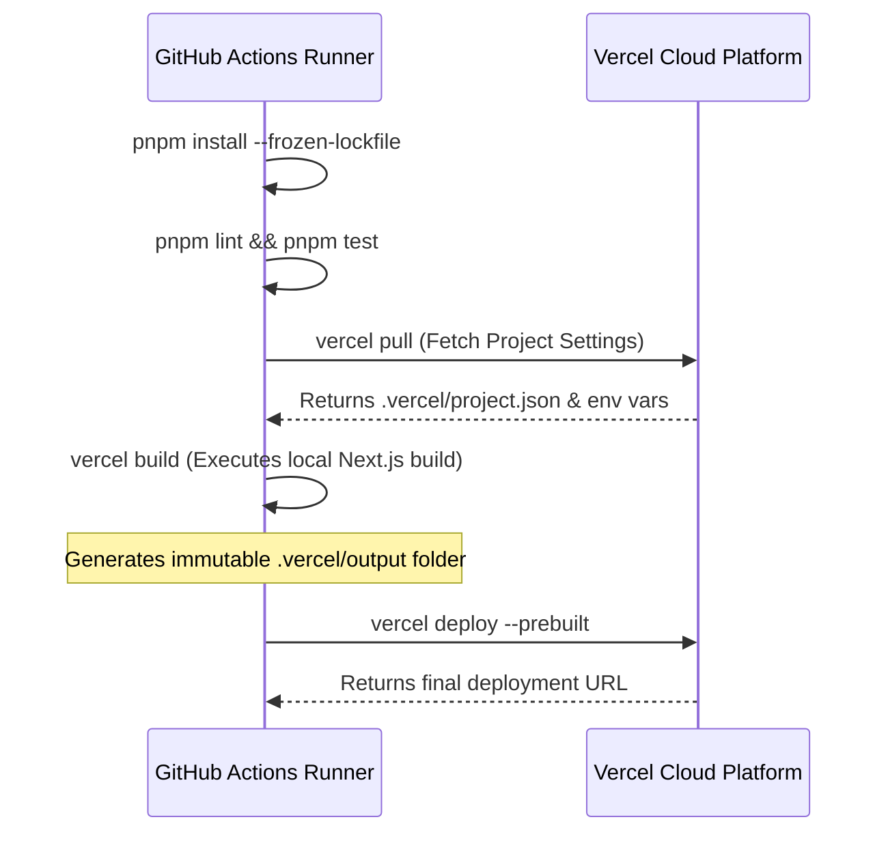

# CI/CD Deployment Guide: Vercel & GitHub Actions Pipeline

* **Document**: `docs/guides/vercel-deployment-pipeline.md`
* **Audience**: DevOps Engineers, Frontend Engineers, Release Managers
* **Relevant Workflow**: [.github/workflows/deploy.yml](../../.github/workflows/deploy.yml)
* **Domain Glossary**: [CONTEXT.md](../../CONTEXT.md)
* **Architecture ADRs**: [ADR-0001 (Dynamic Shadowcasting Component Architecture)](../adr/0001-shadowcasting-component-architecture.md), [ADR-0002 (Decoupled Transparent Shadow Layer Architecture)](../adr/0002-decoupled-transparent-shadow-layer.md)
* **Companion Guides**: [API Reference](api-reference.md), [Editorial Hero Guide](01-editorial-hero.md), [Performance & Degradation Guide](04-performance-and-degradation.md)
* **Repository Root**: [README.md](../../README.md)
* **Live Routes**: [Interactive Playground](/) | [Showcase Hub](/showcase)

---

## 1. Executive Summary & Pipeline Overview

The **Shadowcasting Background Component** repository utilizes an automated, two-job continuous integration and continuous deployment (CI/CD) pipeline managed via GitHub Actions ([`.github/workflows/deploy.yml`](../../.github/workflows/deploy.yml)) and the official Vercel CLI.

The application delivers high-performance lighting simulations combining decoupled static **Base Plate** substrates with dynamic **Shadow Caster** silhouettes. It features variable **Penumbra** diffusion, distance-scaled **Contact Hardening**, a 4-tier **Degradation Tier** ladder, and an instantaneous **Static Poster Fallback** ensuring zero impact on Largest Contentful Paint (Zero-LCP Floor). Because the graphics pipeline involves intricate WebGL and Canvas 2D math, spring-damped physics, and strict accessibility standards, continuous verification must precede every deployment.

### Two-Job Architecture

The pipeline enforces strict separation between code verification and cloud deployment:



1. **Job 1: `quality-gate`**:
   - Executes unconditionally on all pushes, pull requests, and manual dispatches.
   - Sets up Node.js 20 and `pnpm` 11, caching dependency layers for minimal execution overhead.
   - Installs dependencies using `pnpm install --frozen-lockfile`.
   - Runs `pnpm lint` and `pnpm test` across the entire codebase—validating unit physics, shader utilities, component rendering, and documentation link integrity.
   - If linting fails or any test regresses, the workflow terminates immediately, preventing broken builds from reaching Vercel.

2. **Job 2: `deploy`**:
   - Depends strictly on the success of `quality-gate` (`needs: quality-gate`).
   - Verifies whether Vercel credentials are configured; if not, it records a helpful warning in the GitHub Actions Step Summary and exits gracefully without failing the build.
   - Pulls environment metadata using `vercel pull`.
   - Compiles the Next.js application locally on the GitHub runner with `vercel build`, capturing any build issues directly in GitHub Actions logs.
   - Deploys immutable prebuilt artifacts to Vercel with `vercel deploy --prebuilt`.
   - On pull requests, updates or creates a pinned sticky comment with the live preview URL.

---

## 2. GitHub Repository Secrets Provisioning Guide

To enable automated deployments to Vercel, three secrets must be provisioned in your GitHub repository:

| Secret Name | Description | Source in Vercel |
| :--- | :--- | :--- |
| `VERCEL_TOKEN` | Vercel Personal Access Token | Vercel Account Settings → Tokens |
| `VERCEL_ORG_ID` | Vercel Team or Account Identifier | Vercel Account/Team Settings → General |
| `VERCEL_PROJECT_ID` | Vercel Project Identifier | Vercel Project Settings → General |

### Step-by-Step Provisioning Walkthrough

#### Step 1: Generate `VERCEL_TOKEN`
The `VERCEL_TOKEN` grants the GitHub Actions runner authorization to invoke Vercel CLI commands.

1. Navigate to [vercel.com](https://vercel.com) and log in to your account.
2. Click your profile avatar in the upper right-hand corner and select **Account Settings** (or navigate to `https://vercel.com/account/settings`).
3. In the left navigation menu, click **Tokens** (`https://vercel.com/account/tokens`).
4. In the **Create Token** section:
   - **Token Name**: Enter a recognizable identifier (e.g., `github-actions-shadowcasting-ci`).
   - **Scope**: Choose `Full Account` or scope it to your specific team.
   - **Expiration**: Select your preferred rotation interval (e.g., `90 days`, `1 year`, or `No Expiration` for continuous services).
5. Click **Create** and immediately copy the token value to your clipboard. *(Vercel will not display this token again).*

#### Step 2: Retrieve `VERCEL_ORG_ID`
The `VERCEL_ORG_ID` identifies the Vercel organization or user account owning the target project.

1. In the Vercel dashboard, select your target team or personal account from the team switcher.
2. Click the **Settings** tab in the top navigation bar.
3. In the **General** settings panel, scroll to the **Team ID** or **Account ID** field.
4. Copy the identifier (typically formatted as `team_xxxxxxxxxxxxxxxxxxxxxxxx` or similar).

#### Step 3: Retrieve `VERCEL_PROJECT_ID`
The `VERCEL_PROJECT_ID` identifies the specific project instance for this repository.

1. In the Vercel dashboard, select the shadowcasting project (e.g., `shadowcasting-poc`).
2. Click the **Settings** tab for the project.
3. In the **General** section, locate the **Project ID** field.
4. Copy the identifier (typically formatted as `prj_xxxxxxxxxxxxxxxxxxxxxxxx`).

#### Step 4: Configure Secrets in GitHub
1. In your GitHub repository, click the **Settings** tab.
2. In the left sidebar, navigate to **Secrets and variables** → **Actions**.
3. Under **Repository secrets**, click the green **New repository secret** button.
4. Create the three secrets:
   - Name: `VERCEL_TOKEN` → Value: *Paste your Personal Access Token*
   - Name: `VERCEL_ORG_ID` → Value: *Paste your Team/Account ID*
   - Name: `VERCEL_PROJECT_ID` → Value: *Paste your Project ID*
5. Confirm that all three secrets appear in the Repository secrets table.

---

### CLI Shortcut: Automatic Extraction via `vercel link`

If you have the Vercel CLI installed locally on your development workstation, you can extract `VERCEL_ORG_ID` and `VERCEL_PROJECT_ID` in seconds without searching the web console:

1. Install the Vercel CLI globally (or run via `pnpm dlx`):
   ```bash
   npm install --global vercel@latest
   ```

2. Link your local working tree to your Vercel project:
   ```bash
   vercel link
   ```
   Follow the interactive prompts:
   - Log in to your Vercel account.
   - Select your scope (account or team).
   - Link to an existing project? `Y`.
   - Select project name: `shadowcasting-poc`.

3. Inspect the newly created `.vercel/project.json` file:
   ```json
   {
     "orgId": "team_abc123def456ghi789jkl012",
     "projectId": "prj_xyz987wvu654tsr321qpo987"
   }
   ```
   - Set GitHub secret `VERCEL_ORG_ID` = value of `orgId`.
   - Set GitHub secret `VERCEL_PROJECT_ID` = value of `projectId`.

> [!NOTE]
> The `.vercel` directory is registered in `.gitignore` and must never be committed to git. It is used strictly for local development linkage.

---

## 3. Deployment Environments: Production vs. Preview

The workflow routes builds to two distinct deployment environments based on the git event and branch context:

```mermaid
stateDiagram-v2
    [*] --> EventEvaluation
    EventEvaluation --> Production: Push to main OR workflow_dispatch (environment=production)
    EventEvaluation --> Preview: Pull Request to main OR workflow_dispatch (environment=preview)

    state Production {
        PullProd: vercel pull --environment=production
        BuildProd: vercel build --prod
        DeployProd: vercel deploy --prebuilt --prod
        PullProd --> BuildProd --> DeployProd
    }

    state Preview {
        PullPrev: vercel pull --environment=preview
        BuildPrev: vercel build
        DeployPrev: vercel deploy --prebuilt
        StickyPR: Sticky PR Feedback Comment
        PullPrev --> BuildPrev --> DeployPrev --> StickyPR
    }
```

### Production Environment (`main` Branch)

* **Trigger**: Any direct git push or merged pull request to the `main` branch.
* **Execution Flags**:
  - `vercel pull --yes --environment=production --token=${{ secrets.VERCEL_TOKEN }}`
  - `vercel build --prod --token=${{ secrets.VERCEL_TOKEN }}`
  - `vercel deploy --prebuilt --prod --token=${{ secrets.VERCEL_TOKEN }}`
* **Target Domain**: Publishes directly to the canonical production URL (e.g., `https://shadowcasting-poc.vercel.app`) and any configured custom domain aliases.
* **Concurrency Protection**: The workflow sets `cancel-in-progress: ${{ github.ref != 'refs/heads/main' }}`. Production deployments on `main` are **never cancelled mid-flight**, guaranteeing that critical deployment transactions run to completion.

### Preview Environment (Pull Requests)

* **Trigger**: Any pull request opened, synchronized, or reopened targeting the `main` branch.
* **Execution Flags**:
  - `vercel pull --yes --environment=preview --token=${{ secrets.VERCEL_TOKEN }}`
  - `vercel build --token=${{ secrets.VERCEL_TOKEN }}`
  - `vercel deploy --prebuilt --token=${{ secrets.VERCEL_TOKEN }}`
* **Target Domain**: Generates an isolated, immutable preview deployment URL unique to that specific PR branch and commit (e.g., `https://shadowcasting-poc-git-feat-branch-user.vercel.app`).
* **Concurrency Throttling**: In-progress runs for pull request branches are cancelled when newer commits are pushed, preserving GitHub Actions runner capacity.

---

## 4. Sticky PR Preview Comment & Manual Dispatch

### Sticky Pull Request Feedback Comment

To keep pull request conversations clean and eliminate repetitive bot comment spam, the pipeline maintains a single **sticky comment** on the PR thread using `actions/github-script@v7`.

* **Unique Marker**: The comment begins with an invisible HTML marker:
  ```html
  <!-- vercel-preview-deployment-comment -->
  ```
* **Comment Logic**:
  1. The workflow queries existing pull request comments using `github.rest.issues.listComments`.
  2. If a comment containing `<!-- vercel-preview-deployment-comment -->` exists, it updates that comment in-place using `github.rest.issues.updateComment`.
  3. If no matching comment exists, it creates an initial comment using `github.rest.issues.createComment`.
* **Rendered Markdown Table**:
  ```markdown
  ### 🔍 Vercel Preview Deployment

  | Status | Preview URL | Commit | Deployed At |
  | :--- | :--- | :--- | :--- |
  | Ready ✅ | [https://shadowcasting-poc-preview.vercel.app](https://shadowcasting-poc-preview.vercel.app) | `cec24e8` | `2026-09-18T10:44:34.000Z` |

  *Preview URL:* https://shadowcasting-poc-...vercel.app
  *Commit:* `cec24e83f5...`
  *Timestamp:* `2026-09-18T10:44:34.000Z`

  _This comment is automatically maintained by CI/CD workflow._
  ```

### Manual Dispatch Workflow (`workflow_dispatch`)

Maintainers can trigger ad-hoc deployments on demand from the GitHub Actions dashboard without pushing empty git commits:

1. Navigate to the **Actions** tab in your GitHub repository.
2. In the left workflow sidebar, select the **Deploy** workflow.
3. Click the **Run workflow** dropdown button.
4. Select:
   - **Use workflow from**: Choose the branch to deploy.
   - **Target deployment environment**: Select `preview` or `production` from the dropdown.
5. Click the green **Run workflow** button.

---

## 5. Graceful Secret Degradation

In open-source forks, community pull requests, or newly bootstrapped repositories where Vercel secrets have not yet been populated, CI pipelines often fail abruptly with confusing authentication errors.

To preserve a green, informative development experience, `.github/workflows/deploy.yml` implements a **credential verification gate** (`steps.check-creds`):

```bash
if [ -z "$VERCEL_TOKEN" ]; then
  echo "can_deploy=false" >> "$GITHUB_OUTPUT"
  echo "### ⚠️ Deployment Skipped" >> "$GITHUB_STEP_SUMMARY"
  echo "Vercel credentials are not configured (secrets.VERCEL_TOKEN is missing)." >> "$GITHUB_STEP_SUMMARY"
else
  echo "can_deploy=true" >> "$GITHUB_OUTPUT"
fi
```

### Fallback Behavior:
1. When `VERCEL_TOKEN` is unset or empty, `can_deploy` is set to `false`.
2. A clear advisory note is published to the GitHub Actions Step Summary:
   > ⚠️ **Deployment Skipped**
   > Vercel credentials are not configured (`secrets.VERCEL_TOKEN` is missing).
3. All subsequent deployment steps check `if: steps.check-creds.outputs.can_deploy == 'true'` and are skipped.
4. The deployment job terminates cleanly with success status.
5. Pull requests from external contributors remain unblocked, with the full `quality-gate` test and lint suite continuing to enforce code quality.

---

## 6. Local Pre-Build Architecture & Immutable Deployments

Rather than offloading the Next.js compilation step to Vercel's remote cloud builders, the workflow executes the build locally on the GitHub Actions runner using the `--prebuilt` flag:



### Key Architectural Benefits:
1. **Runner Transparency & Faster Feedback**: Next.js compilation, TypeScript type checking, and asset bundling run directly on the GitHub Actions runner. If a build fails, complete logs are immediately visible in the GitHub UI.
2. **Immutable Artifacts**: The exact artifacts validated during local testing are bundled into `.vercel/output` and uploaded directly to Vercel's edge network, eliminating discrepancies between CI environments and hosting platforms.
3. **Bandwidth & Compute Efficiency**: Minimizes redundant build execution on Vercel servers, conserving deployment quotas.

---

## 7. Troubleshooting & Verification Checklist

### Verification Steps
After adding the three repository secrets:
1. Create a lightweight test branch: `git checkout -b test-deploy-docs`.
2. Push a trivial change to documentation and open a Pull Request targeting `main`.
3. Verify that the `quality-gate` job passes (all lint and test assertions green).
4. Verify that the `deploy` job executes, provisions a preview deployment, and posts the sticky PR comment.
5. Click the preview deployment URL to verify that the Next.js shadowcasting application renders the [Interactive Playground](/) and [Showcase Hub](/showcase) with full fidelity.

### Common Issues & Remedies

* **Error: `No existing credentials found`**:
  - *Cause*: `VERCEL_TOKEN` is missing or invalid.
  - *Fix*: Check GitHub Settings → Secrets and variables → Actions, ensure `VERCEL_TOKEN` is defined without leading/trailing whitespace.
* **Error: `Project not found` or `Invalid project id`**:
  - *Cause*: Mismatch in `VERCEL_ORG_ID` or `VERCEL_PROJECT_ID`.
  - *Fix*: Run `vercel link` locally and verify that the values in `.vercel/project.json` match your GitHub Secrets.
* **Error: `Resource not accessible by integration` during PR comment**:
  - *Cause*: GitHub Actions lacks write permissions for pull request comments.
  - *Fix*: Ensure workflow permissions declare `pull-requests: write` and `issues: write`. In GitHub Settings → Actions → General → Workflow permissions, select **Read and write permissions**.
