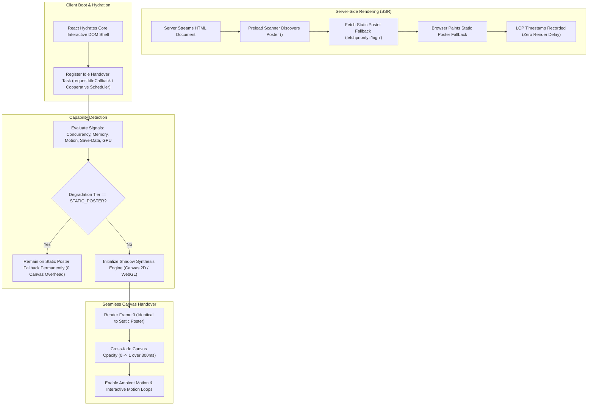

# Research: Next.js Zero-LCP Fallback & Deferred Hydration Patterns for Hero Backgrounds

- **Issue**: [#3 - Research: Next.js Zero-LCP Fallback & Deferred Hydration Patterns for Hero Backgrounds](https://github.com/manuelhe/shadowcasting-poc/issues/3)
- **Status**: Completed
- **Date**: 2026-09-16
- **Domain Context**: [`CONTEXT.md`](../../CONTEXT.md)

---

## Executive Summary

Hero background components featuring rich visuals—such as dynamic procedural foliage or interactive contact-hardened shadows—frequently degrade Core Web Vitals. Specifically, unoptimized canvas initializations destroy **Largest Contentful Paint (LCP)** by delaying resource discovery and blocking the main thread with shader compilation and context setup. Concurrently, improper media sizing and client-side DOM replacement trigger severe **Cumulative Layout Shift (CLS)**.

This research establishes a zero-penalty architecture for an interactive, canvas/filter-heavy Next.js background component. The architecture rests on three pillars:

1. **Dual-Layer Progressive Handover**: An SSR-rendered **Static Poster Fallback** delivered via `next/image` with `priority` and `fill` captures the LCP paint instant within the initial HTML streaming phase. The dynamic **Shadow Synthesis Engine** (Canvas 2D or WebGL) hydrates lazily during browser idle periods, renders its initial frame (Frame 0) to match the poster, and executes a hardware-accelerated opacity cross-fade. The **Static Poster Fallback** is retained in the DOM underneath the canvas to preserve Web Vitals attribution, prevent layout thrashing, and provide an instant recovery floor if a canvas context is lost.
2. **Deterministic Capability Gating**: A multi-signal heuristic evaluates client capabilities—respecting W3C specifications and platform-specific privacy protections (notably WebKit's hardware concurrency clamping on iOS)—to assign clients to an appropriate **Degradation Tier**. Low-end devices, users requesting reduced motion, and constrained networks remain permanently on the **Static Poster Fallback**, executing zero runtime canvas scripts.
3. **Strict Geometry Containment**: Zero CLS ($0.000$) is guaranteed by establishing an absolute coordinate containment boundary where both the **Base Plate** poster and the dynamic canvas share an identical bounding box governed by parent aspect ratio constraints.



---

## 1. Core Web Vitals Mechanics: LCP & CLS Under the Hood

### 1.1 W3C Largest Contentful Paint (LCP) Specification Analysis

According to the [W3C Largest Contentful Paint Specification](https://www.w3.org/TR/largest-contentful-paint/) and [web.dev LCP Guidelines](https://web.dev/articles/optimize-lcp), the LCP metric tracks the render timestamp of the largest image or text block visible within the viewport.

#### Critical Candidate Eligibility Caveat
Under the W3C specification (§5.1 Element Candidates), only the following DOM elements are eligible LCP candidates:
- `` elements (and first-frame presentation times for animated image formats).
- `<image>` elements inside an `<svg>` container.
- `<video>` elements (using the poster image load time or first-frame presentation time).
- Elements with a background image loaded via the CSS `url()` function.
- Block-level elements containing text nodes or inline-level text children.

> **Crucial Architectural Fact**: Raw `<canvas>` and inline `<svg>` elements are **excluded** from direct LCP consideration in the W3C specification to limit rendering overhead. If a hero section relies solely on a client-mounted `<canvas>`, the browser cannot record the canvas as an LCP candidate; instead, LCP tracking falls back to other candidates (such as hero headline text) or remains unrecorded until interaction, severely distorting performance telemetry.

#### The Four Subparts of LCP
A page's LCP is divided into four distinct phases:

$$\text{LCP} = \text{TTFB} + \text{Resource Load Delay} + \text{Resource Load Duration} + \text{Element Render Delay}$$

| Subpart | Target % | Problem in Dynamic Canvas Hero | How Static Poster Fallback Resolves It |
| :--- | :--- | :--- | :--- |
| **Time to First Byte (TTFB)** | $< 40\%$ | Server-side canvas rendering / heavy node computations delay initial byte. | Server-rendered HTML shell streams immediately with static poster markup. |
| **Resource Load Delay** | $< 10\%$ | Canvas scripts or image assets discovered late after client bundle parsing. | Next.js `priority` injects `<link rel="preload" as="image" fetchpriority="high">` into `<head>`. |
| **Resource Load Duration** | $\approx 40\%$ | Large unoptimized textures downloaded over unprioritized HTTP channels. | Static poster served in next-gen formats (AVIF/WebP) with responsive `srcset` from CDN. |
| **Element Render Delay** | $< 10\%$ | WebGL shader compilation, context setup, and JS hydration delay canvas frame. | Browser paints static `` synchronously upon decode (`decoding="async"`) before JS boots. |

#### DOM Detachment & Telemetry Persistence
According to W3C LCP specifications and Chromium 88+ telemetry changes:
1. When an LCP candidate element paints, its timestamp is logged. If that element is subsequently removed from the DOM, **the timestamp remains the recorded LCP metric** unless a larger paint occurs before user interaction.
2. However, detaching the element sets the `LargestContentfulPaint.element` getter to `null`.
3. If an agent or component unmounts the `<Image>` poster when the `<canvas>` mounts, Real User Monitoring (RUM) scripts (such as Google Chrome UX Report, Datadog, or Sentry) lose the DOM reference to the hero node.
4. **Design Decision**: Retaining the `<Image>` in the DOM underneath the canvas preserves the element pointer in RUM telemetry, prevents layout recalculation, and provides an immediate visual fallback if WebGL context is lost.

### 1.2 Cumulative Layout Shift (CLS) Prevention Mechanics

According to [web.dev CLS Guidelines](https://web.dev/articles/optimize-cls), layout shifts occur when existing DOM elements change their start position between frames.

In canvas-heavy hero sections, layout shifts stem from three pitfalls:
1. **Unsized Canvas Injection**: A `<canvas>` element without explicit inline HTML `width` and `height` attributes defaults to $300 \times 150\text{ px}$. When JavaScript initializes and resizes the canvas to match client dimensions, subsequent DOM siblings are pushed downwards.
2. **Hydration Dimension Discrepancies**: Dynamic components that read `window.innerWidth` during hydration and conditionally apply CSS classes cause layout shifts between the SSR placeholder and the hydrated tree.
3. **AspectRatio Collapses**: Removing the poster image upon canvas mount collapses container height if the container relied on image intrinsic sizing.

#### Geometric Containment Solution
To guarantee a CLS score of strictly **0.000**:
- The parent hero wrapper establishes an explicit aspect ratio or absolute viewport footprint:
  ```css
  .hero-container {
    position: relative;
    width: 100%;
    min-height: 100vh; /* or aspect-ratio: 16 / 9; */
    overflow: hidden;
  }
  ```
- Both the **Static Poster Fallback** and the dynamic canvas use absolute coordinates with `inset: 0; width: 100%; height: 100%`.
- The canvas drawing buffer resolution (`canvas.width` and `canvas.height`) is synchronized to the container's physical pixel bounding box ($W \times \text{DPR}$) via `ResizeObserver`, independent of CSS layout positioning.

---

## 2. Coordination Architecture: SSR Poster Fallback to Dynamic Canvas Handover

### 2.1 Component DOM Structure

The hero background is architected as an absolute stacking context containing three isolated layers:

```
┌────────────────────────────────────────────────────────┐
│ Hero Container (position: relative; overflow: hidden)   │
│                                                        │
│  ┌──────────────────────────────────────────────────┐  │
│  │ Layer 0: Base Plate & Static Poster Fallback     │  │
│  │ <Image priority fill sizes="100vw" ... />        │  │
│  └──────────────────────────────────────────────────┘  │
│                                                        │
│  ┌──────────────────────────────────────────────────┐  │
│  │ Layer 1: Dynamic Shadow Synthesis Engine         │  │
│  │ <canvas className="absolute inset-0 ..." />      │  │
│  └──────────────────────────────────────────────────┘  │
│                                                        │
│  ┌──────────────────────────────────────────────────┐  │
│  │ Layer 2: Foreground Content (z-index: 10)        │  │
│  │ Heading, CTAs, Navigation, Interactive UI        │  │
│  └──────────────────────────────────────────────────┘  │
└────────────────────────────────────────────────────────┘
```

#### Why `next/image` with `priority` is Mandatory
When `<Image priority fill ... />` is rendered in Next.js (App Router Server Component):
1. **Preload Scanner Discovery**: Next.js automatically emits a preload hint into the HTML document's `<head>`:
   ```html
   <link rel="preload" as="image" href="/hero-poster.avif" fetchpriority="high" imagesrcset="..." imagesizes="100vw">
   ```
2. **Bandwidth Prioritization**: The underlying `` tag receives `fetchpriority="high"` and `loading="eager"`. Browsers prioritize downloading the poster over non-critical JavaScript chunks and stylesheets.
3. **Async Decoding**: `decoding="async"` ensures that the decoding of the high-resolution poster image does not stall the main thread during initial document parsing.

### 2.2 Hydration Lifecycle & Idle Scheduling

Executing canvas context creation, GLSL shader compilation, and texture uploads during the critical hydration phase blocks the main thread, directly inflating **Total Blocking Time (TBT)** and degrading **Interaction to Next Paint (INP)**.

To eliminate this friction, the component employs a multi-phase hydration lifecycle:

```
[Phase 1: SSR HTML Stream]
  └── Render <Image priority fill> (Static Poster Fallback)
  └── Zero client JS execution; LCP triggers instantly upon image paint

[Phase 2: Core Hydration]
  └── React hydrates text & critical interactive UI (buttons, navbar)
  └── Dynamic canvas component imported via next/dynamic with ssr: false

[Phase 3: Idle Scheduling & Capability Gating]
  └── Queue task using requestIdleCallback (timeout: 2000ms) with rAF/setTimeout fallback
  └── Execute capability detection heuristic
  └── IF tier == STATIC_POSTER: Abort canvas mount; exit permanently

[Phase 4: Buffer Priming (Frame 0)]
  └── Initialize WebGL2 / Canvas 2D context with failIfMajorPerformanceCaveat: true
  └── Draw initial Frame 0 (procedural shadow caster aligned to poster silhouette)
  └── Canvas remains styled at opacity: 0

[Phase 5: Seamless Handover]
  └── Toggle canvas opacity to 1 via CSS transition (300ms ease-out)
  └── Underlying poster remains in DOM at z-index: 0
  └── Start requestAnimationFrame loops for Ambient Motion and Interactive Motion
```

### 2.3 Visual Continuity: Preventing Flash & Glitch

To ensure zero visual discontinuity during the handover:
1. **Frame 0 Alignment**: The procedural parameters of the dynamic **Shadow Caster** (light angle, penumbra radius, foliage coordinates) at $t = 0$ must mathematically match the rendered shadow baked into the **Static Poster Fallback**.
2. **Hardware-Accelerated Compositing**:
   - The canvas element is assigned `will-change: opacity` and `transform: translateZ(0)` to promote it to its own GPU compositing layer.
   - When Frame 0 finishes rasterizing to the backbuffer, the component sets `data-ready="true"`, triggering a GPU-composited cross-fade:
     ```css
     .shadow-canvas {
       opacity: 0;
       transition: opacity 300ms cubic-bezier(0.16, 1, 0.3, 1);
     }
     .shadow-canvas[data-ready="true"] {
       opacity: 1;
     }
     ```
3. **Context Loss Handling**:
   - WebGL contexts can be reclaimed by the OS during memory pressure via the `webglcontextlost` event.
   - Because the **Static Poster Fallback** remains mounted directly beneath the canvas, listening to `webglcontextlost` allows the component to immediately reset canvas `opacity` to `0`, restoring the crisp static poster with zero rendering glitch.

---

## 3. Capability Detection Heuristics & Degradation Tiers

### 3.1 Primary Sources & Specification Analysis

To select the correct **Degradation Tier**, the client evaluates five standardized signals:

| Signal | Primary Specification | Browser Support (2026) | Privacy Defense / Constraints |
| :--- | :--- | :--- | :--- |
| `prefers-reduced-motion` | [W3C Media Queries Level 5 §11.1](https://www.w3.org/TR/mediaqueries-5/#prefers-reduced-motion) | Universal Baseline (All modern browsers) | Low-entropy boolean preference. |
| `save-data` | [W3C / WICG Network Information API §4.2](https://wicg.github.io/netinfo/) | Chromium-only (`navigator.connection.saveData`) | Exposes explicit user data-saver preference. |
| `deviceMemory` | [W3C Device Memory Specification §2](https://www.w3.org/TR/device-memory-1/) | Chromium-only (`navigator.deviceMemory`) | Quantized to $0.25, 0.5, 1, 2, 4, 8\text{ GiB}$. `undefined` in Safari and Firefox. |
| `hardwareConcurrency` | [WHATWG HTML Living Standard §10.2.7](https://html.spec.whatwg.org/multipage/workers.html#navigatorconcurrenthardware) | Universal Baseline (Chrome, Firefox, Safari) | **WebKit Clamping**: Clamped to $2$ on iOS/iPadOS; clamped to $8$ on macOS. |
| WebGL Caveats | [Khronos WebGL 1.0/2.0 Context Attributes §5.2.1](https://registry.khronos.org/webgl/specs/latest/1.0/#5.2.1) | Universal Baseline (All modern browsers) | `failIfMajorPerformanceCaveat: true` rejects software rasterizers (SwiftShader/Mesa). |

### 3.2 Deep Dive: The Safari Hardware Concurrency Trap

A frequent pitfall in capability detection scripts is using a naive threshold on `navigator.hardwareConcurrency`:

```javascript
// DANGEROUS ANTI-PATTERN:
if (navigator.hardwareConcurrency <= 2) {
  return DegradationTier.STATIC_POSTER;
}
```

> **Critical WebKit Fingerprinting Finding**: To prevent cross-site hardware tracking, Apple WebKit explicitly clamps `navigator.hardwareConcurrency` to a maximum value of **2 on all iOS and iPadOS devices** (regardless of whether the device is an entry-level iPhone or an M4 iPad Pro).
>
> If a developer applies `hardwareConcurrency <= 2` as a downgrade signal, **100% of iPhone and iPad users running Safari are downgraded to the Static Poster Fallback**, completely bypassing high-performance Apple Silicon GPUs.
>
> **Solution**:
> - Treat `hardwareConcurrency === 1` as a universal signal for an ultra-constrained CPU or single-core virtualized environment.
> - On Apple platforms (detectable via `navigator.maxTouchPoints > 0 && /Macintosh|iPhone|iPad/.test(navigator.userAgent)`), treat `hardwareConcurrency === 2` as standard behavior, not a low-end indicator.

### 3.3 Deep Dive: The `deviceMemory` Support Void

The W3C Device Memory specification exposes `navigator.deviceMemory` in gigabytes. To prevent hardware fingerprinting:
1. Values are rounded to powers of 2 ($0.25, 0.5, 1, 2, 4, 8$).
2. Values are capped at $8\text{ GiB}$ to mask high-end workstations.
3. Both Mozilla Firefox and Apple Safari **refuse to implement `navigator.deviceMemory`**, intentionally returning `undefined`.

> **Rule**: An `undefined` return value for `navigator.deviceMemory` must never be coerced to zero or treated as low memory. It simply indicates a non-Chromium browser.

### 3.4 Deep Dive: `failIfMajorPerformanceCaveat`

When requesting a WebGL or WebGL2 context, setting `{ failIfMajorPerformanceCaveat: true }` instructs the browser to abort context creation and return `null` if the GPU is blacklisted, disabled, or if rendering would rely on a CPU software rasterizer (such as Google SwiftShader or Mesa llvmpipe).

Dynamic shadow synthesis (evaluating contact hardening, multi-tap penumbra blurs, and ambient foliage sway) running on a software rasterizer spikes CPU usage to $100\%$ and drops frame rates below $10\text{ FPS}$. Detecting context failure here allows an instantaneous fallback to the **Static Poster Fallback**.

### 3.5 Degradation Tier Matrix

The component categorizes devices into three formal **Degradation Tiers**:

```mermaid
graph TD
    Start([Evaluate Device Capabilities]) --> Q1{prefers-reduced-motion?}
    Q1 -- Yes --> Tier0[Tier 0: STATIC_POSTER]
    Q1 -- No --> Q2{save-data == true OR<br/>effectiveType == 'slow-2g'|'2g'?}
    Q2 -- Yes --> Tier0
    Q2 -- No --> Q3{hardwareConcurrency == 1 OR<br/>(deviceMemory != null AND deviceMemory <= 1)?}
    Q3 -- Yes --> Tier0
    Q3 -- No --> Q4{WebGL Context with<br/>failIfMajorPerformanceCaveat?}
    Q4 -- Fails / Null --> Tier0
    Q4 -- Success --> Q5{deviceMemory == 2 OR<br/>(concurrency <= 2 AND !isAppleTouch)?}
    Q5 -- Yes --> Tier1[Tier 1: LOW_FIDELITY<br/>Static Dynamic + Interactive Parallax<br/>Ambient Loop Paused]
    Q5 -- No --> Tier2[Tier 2: FULL_DYNAMIC<br/>60 FPS Ambient Motion +<br/>Interactive Motion]
```

| Tier | Target Hardware / Profile | Visual Behavior | Runtime Cost |
| :--- | :--- | :--- | :--- |
| **Tier 0: Static Poster Fallback** | `prefers-reduced-motion: reduce`<br>`Save-Data: on`<br>`deviceMemory <= 1`<br>`concurrency == 1`<br>Software WebGL rasterizer | Single static image rendered via SSR `next/image`. Canvas element is never mounted; zero JS loops. | $0\text{ ms}$ main thread<br>$0\text{ MB}$ GPU memory |
| **Tier 1: Low-Fidelity Dynamic** | Budget mobile (`deviceMemory == 2`), low-tier laptops | Canvas renders Frame 0; executes **Interactive Motion** (pointer parallax) on user event; **Ambient Motion** sway loop is suspended. Canvas DPR capped at $1.0$. | $< 2\text{ ms}$ per interaction event<br>$\approx 15\text{ MB}$ GPU memory |
| **Tier 2: Full Dynamic** | Modern desktop, flagship mobile (Apple Silicon, Snapdragon 8 Gen+) | Continuous 60 FPS **Ambient Motion** (procedural wind sway) combined with smooth **Interactive Motion** (pointer displacement). DPR capped at $2.0$. | Full 60 FPS requestAnimationFrame loop<br>$\approx 40\text{ MB}$ GPU memory |

---

## 4. Reference Implementation Architecture

The following reference implementation provides production-grade TypeScript components and utilities for Next.js 15 (App Router).

### 4.1 Capability Detector Module

```typescript
// src/components/shadow-background/capability-detector.ts

export enum DegradationTier {
  STATIC_POSTER = 0,
  LOW_FIDELITY = 1,
  FULL_DYNAMIC = 2,
}

interface NavigatorExtended extends Navigator {
  deviceMemory?: number;
  connection?: {
    saveData?: boolean;
    effectiveType?: 'slow-2g' | '2g' | '3g' | '4g';
  };
}

export function detectDegradationTier(): DegradationTier {
  if (typeof window === 'undefined') {
    return DegradationTier.STATIC_POSTER;
  }

  // 1. Accessibility: prefers-reduced-motion (WCAG 2.2 SC 2.3.3)
  const prefersReducedMotion = window.matchMedia('(prefers-reduced-motion: reduce)').matches;
  if (prefersReducedMotion) {
    return DegradationTier.STATIC_POSTER;
  }

  const nav = window.navigator as NavigatorExtended;

  // 2. Data Saver & Network Constraints
  if (nav.connection?.saveData === true) {
    return DegradationTier.STATIC_POSTER;
  }
  if (nav.connection?.effectiveType === 'slow-2g' || nav.connection?.effectiveType === '2g') {
    return DegradationTier.STATIC_POSTER;
  }

  // 3. Hardware Concurrency & Apple WebKit Clamping Defense
  const concurrency = nav.hardwareConcurrency ?? 4;
  if (concurrency <= 1) {
    return DegradationTier.STATIC_POSTER;
  }

  // Detect iOS / iPadOS WebKit where hardwareConcurrency is hard-clamped to 2
  const isAppleTouch = nav.maxTouchPoints > 0 && /Macintosh|iPhone|iPad/.test(nav.userAgent);

  // 4. Device Memory (Chromium-only; undefined in Safari/Firefox)
  const memory = nav.deviceMemory;
  if (typeof memory === 'number' && memory <= 1) {
    return DegradationTier.STATIC_POSTER;
  }

  // 5. Hardware GPU Acceleration Verification
  try {
    const testCanvas = document.createElement('canvas');
    const gl = testCanvas.getContext('webgl2', { failIfMajorPerformanceCaveat: true })
            || testCanvas.getContext('webgl', { failIfMajorPerformanceCaveat: true });
    if (!gl) {
      return DegradationTier.STATIC_POSTER;
    }
    // Clean up test context
    const loseContext = gl.getExtension('WEBGL_lose_context');
    loseContext?.loseContext();
  } catch {
    return DegradationTier.STATIC_POSTER;
  }

  // 6. Tier Allocation
  // Classify budget hardware as Low-Fidelity
  if (
    (typeof memory === 'number' && memory <= 2) ||
    (!isAppleTouch && concurrency <= 2)
  ) {
    return DegradationTier.LOW_FIDELITY;
  }

  return DegradationTier.FULL_DYNAMIC;
}
```

### 4.2 Cooperative Idle Scheduler Hook

```typescript
// src/components/shadow-background/use-idle-scheduler.ts
import { useEffect, useState } from 'react';

export function useIdleScheduler(timeoutMs: number = 2000): boolean {
  const [isIdleReady, setIsIdleReady] = useState(false);

  useEffect(() => {
    let handle: number;

    if (typeof window !== 'undefined' && 'requestIdleCallback' in window) {
      handle = (window as Window).requestIdleCallback(
        () => setIsIdleReady(true),
        { timeout: timeoutMs }
      );
      return () => (window as Window).cancelIdleCallback(handle);
    }

    // Cooperative fallback for Safari (which keeps requestIdleCallback behind a flag)
    const start = Date.now();
    const timerId = window.setTimeout(() => {
      // Yield to the browser frame before dispatching
      requestAnimationFrame(() => setIsIdleReady(true));
    }, Math.min(timeoutMs, 50));

    return () => window.clearTimeout(timerId);
  }, [timeoutMs]);

  return isIdleReady;
}
```

### 4.3 Client Canvas Component with Seamless Handover

```tsx
// src/components/shadow-background/ShadowCanvas.tsx
'use client';

import React, { useEffect, useRef, useState } from 'react';
import { useIdleScheduler } from './use-idle-scheduler';
import { detectDegradationTier, DegradationTier } from './capability-detector';

interface ShadowCanvasProps {
  className?: string;
}

export default function ShadowCanvas({ className = '' }: ShadowCanvasProps) {
  const canvasRef = useRef<HTMLCanvasElement | null>(null);
  const isIdle = useIdleScheduler(1500);
  const [tier, setTier] = useState<DegradationTier | null>(null);
  const [isReady, setIsReady] = useState(false);

  useEffect(() => {
    if (!isIdle) return;

    const detectedTier = detectDegradationTier();
    setTier(detectedTier);

    if (detectedTier === DegradationTier.STATIC_POSTER) {
      // Abort canvas initialization completely
      return;
    }

    const canvas = canvasRef.current;
    if (!canvas) return;

    const ctx = canvas.getContext('2d', { alpha: true });
    if (!ctx) return;

    // Sizing drawing buffer to physical device pixels
    const dpr = Math.min(window.devicePixelRatio || 1, detectedTier === DegradationTier.LOW_FIDELITY ? 1 : 2);
    const rect = canvas.getBoundingClientRect();
    canvas.width = rect.width * dpr;
    canvas.height = rect.height * dpr;

    // Render Frame 0: Must match the Static Poster Fallback shadow geometry
    ctx.scale(dpr, dpr);
    renderFrame0(ctx, rect.width, rect.height);

    // Frame 0 primed in backbuffer: Trigger seamless opacity cross-fade
    requestAnimationFrame(() => {
      setIsReady(true);
    });

    // Start motion loops if High Tier
    let animId: number;
    if (detectedTier === DegradationTier.FULL_DYNAMIC) {
      let startTime = performance.now();
      const loop = (time: number) => {
        const elapsed = (time - startTime) / 1000;
        renderAmbientSway(ctx, rect.width, rect.height, elapsed);
        animId = requestAnimationFrame(loop);
      };
      animId = requestAnimationFrame(loop);
    }

    return () => {
      if (animId) cancelAnimationFrame(animId);
    };
  }, [isIdle]);

  if (tier === DegradationTier.STATIC_POSTER) {
    return null;
  }

  return (
    <canvas
      ref={canvasRef}
      aria-hidden="true"
      className={`absolute inset-0 w-full h-full pointer-events-none transition-opacity duration-500 ease-out ${
        isReady ? 'opacity-100' : 'opacity-0'
      } ${className}`}
      style={{ willChange: 'opacity', transform: 'translateZ(0)' }}
    />
  );
}

function renderFrame0(ctx: CanvasRenderingContext2D, width: number, height: number) {
  // Prime Frame 0 canvas state matching the static poster's baked caster
  ctx.save();
  ctx.fillStyle = 'rgba(0, 0, 0, 0.4)';
  ctx.filter = 'blur(12px)';
  ctx.beginPath();
  ctx.ellipse(width * 0.7, height * 0.3, 140, 70, Math.PI / 6, 0, Math.PI * 2);
  ctx.fill();
  ctx.restore();
}

function renderAmbientSway(ctx: CanvasRenderingContext2D, width: number, height: number, time: number) {
  ctx.clearRect(0, 0, width, height);
  ctx.save();
  const swayOffset = Math.sin(time * 1.5) * 15;
  ctx.fillStyle = 'rgba(0, 0, 0, 0.4)';
  ctx.filter = 'blur(12px)';
  ctx.beginPath();
  ctx.ellipse(width * 0.7 + swayOffset, height * 0.3, 140, 70, Math.PI / 6, 0, Math.PI * 2);
  ctx.fill();
  ctx.restore();
}
```

### 4.4 SSR Server Component Wrapper

```tsx
// src/components/shadow-background/HeroBackground.tsx
import React from 'react';
import Image from 'next/image';
import dynamic from 'next/dynamic';

// Next.js dynamic import with ssr: false ensures canvas code chunk is excluded from SSR HTML
const ShadowCanvas = dynamic(() => import('./ShadowCanvas'), {
  ssr: false,
});

interface HeroBackgroundProps {
  posterSrc: string;
  posterAlt?: string;
  children?: React.ReactNode;
}

export function HeroBackground({
  posterSrc,
  posterAlt = '',
  children,
}: HeroBackgroundProps) {
  return (
    <div className="relative w-full min-h-[600px] h-screen overflow-hidden">
      {/* 
        Layer 0: Base Plate & Static Poster Fallback 
        - priority={true} forces <link rel="preload"> in <head> and fetchpriority="high"
        - fill={true} assigns absolute positioning matching container bounds
        - Prevents CLS by locking layout geometry before image download
        - Retained in DOM underneath canvas to protect LCP attribution and context loss
      */}
      <Image
        src={posterSrc}
        alt={posterAlt}
        fill
        priority
        sizes="100vw"
        className="object-cover pointer-events-none select-none z-0"
        aria-hidden="true"
      />

      {/* Layer 1: Dynamic Shadow Synthesis Engine (Hydrates on Client Idle) */}
      <ShadowCanvas className="z-[1]" />

      {/* Layer 2: Foreground UI Content */}
      <div className="relative z-10 w-full h-full flex flex-col justify-center items-center">
        {children}
      </div>
    </div>
  );
}
```

---

## 5. Architectural Verification & Performance Audit Protocol

To empirically prove that this pattern achieves zero negative impact on LCP and CLS, test implementations must execute the following automated validation protocol:

### 5.1 Lab Measurement (Lighthouse & Chrome DevTools MCP)

1. **LCP Subpart Breakdown**:
   - Run a trace using Chrome DevTools Performance panel with network throttling (`Fast 3G`) and CPU throttling (`4x Slowdown`).
   - Audit the `LCPBreakdown` insight:
     - **Resource Load Delay** must be $< 100\text{ ms}$ (verified via `<link rel="preload">` in `<head>`).
     - **Element Render Delay** must be $< 50\text{ ms}$ (image renders immediately on decode).
     - **LCP Element**: Must resolve to the `HTMLImageElement` (`posterSrc`).
2. **CLS Verification**:
   - The layout stability trace must report `CumulativeLayoutShift = 0.000`.
   - Ensure no `layout-shift` entries fire when `ShadowCanvas` finishes loading or switches opacity from $0$ to $1$.
3. **Total Blocking Time (TBT) & INP**:
   - Hydration of the main document must contain zero tasks exceeding $50\text{ ms}$.
   - Shader compilation and canvas context initialization must execute within the scheduled idle slice without dropping frames.

### 5.2 Field Measurement (Real User Monitoring)

Deploy the `web-vitals` library to verify candidate attribution in real-world environments:

```javascript
import { onLCP, onCLS, onINP } from 'web-vitals';

onLCP((metric) => {
  console.log('LCP Value (ms):', metric.value);
  console.log('LCP Target Element:', metric.entries[metric.entries.length - 1]?.element);
});

onCLS((metric) => {
  console.log('CLS Value:', metric.value);
});
```

Verify that `metric.entries[...].element` consistently points to the static poster image node rather than returning `null`.

---

## 6. Primary Sources & Citations

1. **W3C Largest Contentful Paint Specification**  
   *W3C Web Performance Working Group Draft*  
   URL: [https://www.w3.org/TR/largest-contentful-paint/](https://www.w3.org/TR/largest-contentful-paint/)  
   *Defines LCP candidate element eligibility (§5.1), noting the explicit exclusion of `<canvas>` and behavior upon DOM element detachment.*

2. **W3C Cumulative Layout Shift Metric Specification**  
   *W3C Web Performance Working Group*  
   URL: [https://web.dev/articles/optimize-cls](https://web.dev/articles/optimize-cls)  
   *Establishes layout shift calculation formulas, unsized media layout reflows, and geometric containment criteria.*

3. **W3C Device Memory API Specification**  
   *W3C Web Platform Working Group Candidate Recommendation*  
   URL: [https://www.w3.org/TR/device-memory-1/](https://www.w3.org/TR/device-memory-1/)  
   *Specifies `navigator.deviceMemory`, value quantization ($0.25$ to $8\text{ GiB}$), and secure context restrictions to mitigate device fingerprinting.*

4. **WHATWG HTML Living Standard - Concurrent Hardware Capabilities**  
   *Web Hypertext Application Technology Working Group*  
   URL: [https://html.spec.whatwg.org/multipage/workers.html#navigatorconcurrenthardware](https://html.spec.whatwg.org/multipage/workers.html#navigatorconcurrenthardware)  
   *Defines `navigator.hardwareConcurrency` and permits user agents to clamp exposed core counts for privacy defense.*

5. **WebKit Tracking Prevention & Hardware Concurrency Policy**  
   *Apple WebKit Security & Privacy Documentation*  
   URL: [https://webkit.org/tracking-prevention/](https://webkit.org/tracking-prevention/)  
   *Documents WebKit's intentional clamping of `hardwareConcurrency` to 2 on iOS/iPadOS to prevent mobile fingerprinting.*

6. **W3C Media Queries Level 5 - User Preference Media Features**  
   *W3C CSS Working Group Draft*  
   URL: [https://www.w3.org/TR/mediaqueries-5/#prefers-reduced-motion](https://www.w3.org/TR/mediaqueries-5/#prefers-reduced-motion)  
   *Defines the `@media (prefers-reduced-motion)` feature and WCAG accessibility standards for vestibular disorder mitigation.*

7. **W3C / WICG Network Information API**  
   *Web Platform Incubator Community Group*  
   URL: [https://wicg.github.io/netinfo/](https://wicg.github.io/netinfo/)  
   *Defines `navigator.connection.saveData` and `effectiveType` client hints for data-saving preferences.*

8. **Khronos WebGL 1.0 & 2.0 Specification**  
   *Khronos Group WebGL Working Group*  
   URL: [https://registry.khronos.org/webgl/specs/latest/1.0/#5.2.1](https://registry.khronos.org/webgl/specs/latest/1.0/#5.2.1)  
   *Specifies `failIfMajorPerformanceCaveat` context creation attribute to prevent fallback to software CPU rasterization.*

9. **Next.js Documentation: Image Component and Optimization**  
   *Vercel Next.js Documentation*  
   URL: [https://nextjs.org/docs/app/api-reference/components/image](https://nextjs.org/docs/app/api-reference/components/image)  
   *Documents `priority`, `fill`, automatic preload tag injection, and fetchpriority high semantics.*

10. **Google web.dev: Optimize Largest Contentful Paint**  
    *Google Chrome Developer Relations*  
    URL: [https://web.dev/articles/optimize-lcp](https://web.dev/articles/optimize-lcp)  
    *Breaks down the 4 subparts of LCP and provides strategies for eliminating resource load and render delays.*
